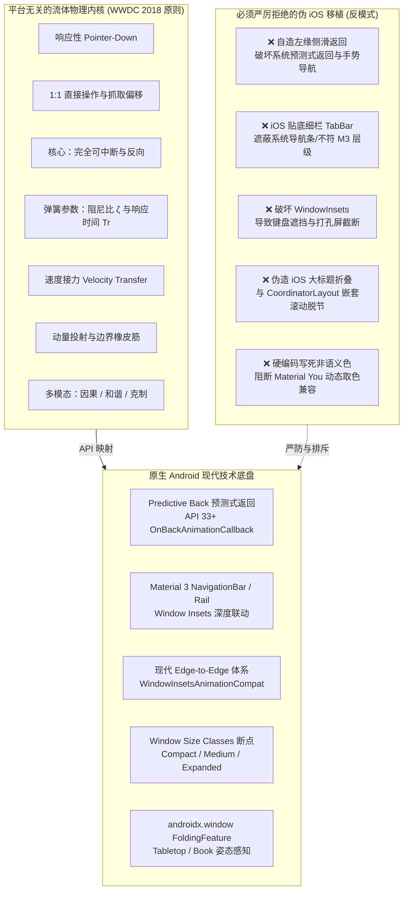
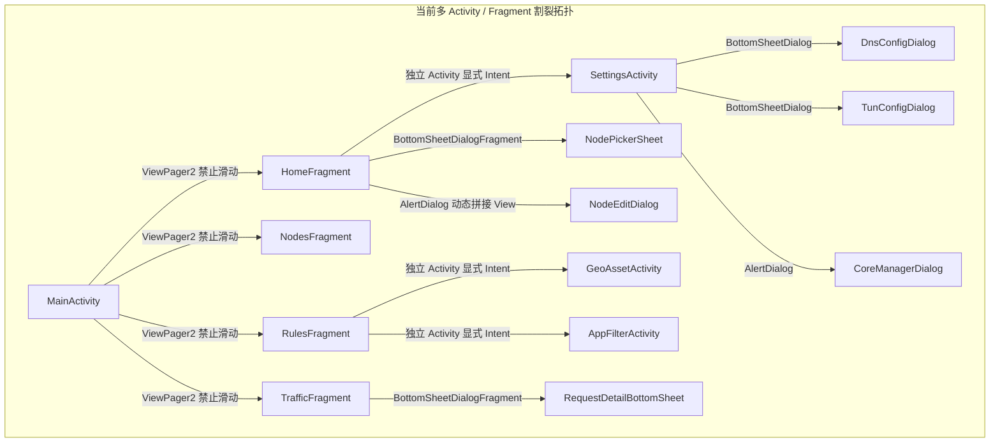
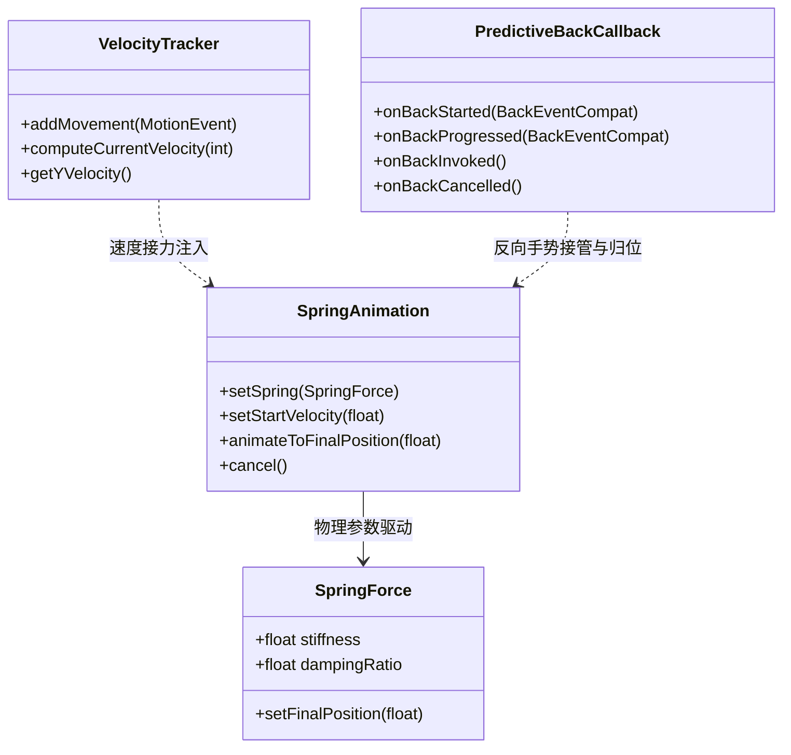
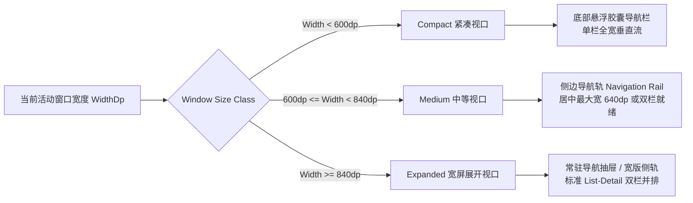
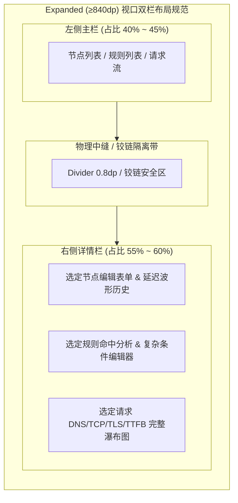
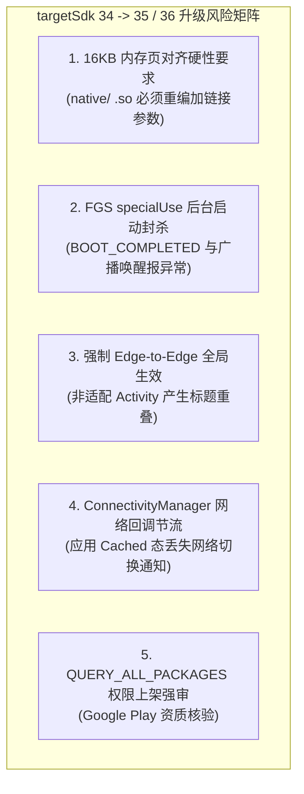
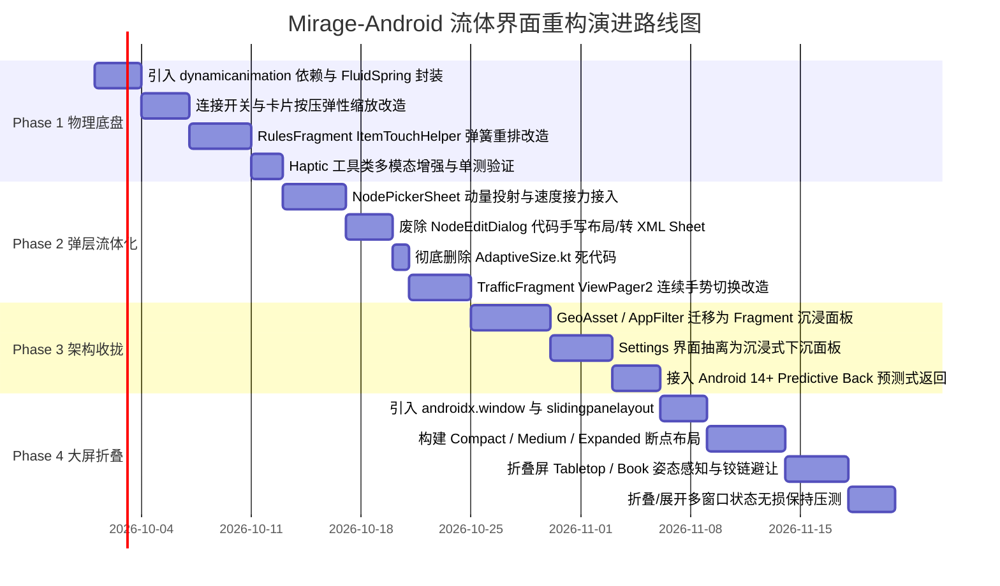

# Mirage-Android 结构、交互与布局流体界面重设计方案

> **文档性质**：架构与交互技术提案（Architecture & Interaction Technical Proposal）  
> **面向对象**：高级 Android 工程师 / 架构师 / UI 系统开发负责人  
> **基线状态**：基于 Android 客户端当前主线分支 `main`（提交基线 `d7f628c` / 本地工作区状态）  
> **工程现状约束**：纯 View + XML + ViewBinding 体系，无 Compose；`compileSdk 34` / `targetSdk 34`；i18n 严格门禁；容器内 Gradle 构建环境。  
> **文件版本**：v1.0-Proposal（2026-09-21）

---

## 目录

- [0. 核心宗旨：将 WWDC 流体界面原则注入 Android，而非机械复刻 iOS](#0-核心宗旨将-wwdc-流体界面原则注入-android而非机械复刻-ios)
  - [0.1 可迁移的平台无关流体原则（物理规律与认知科学）](#01-可迁移的平台无关流体原则物理规律与认知科学)
  - [0.2 必须拒绝迁移的平台反模式（与 Android 系统底线冲突）及技术理由](#02-必须拒绝迁移的平台反模式与-android-系统底线冲突及技术理由)
- [1. 现状解构与缺陷审计（基于源码）](#1-现状解构与缺陷审计基于源码)
  - [1.1 架构与导航骨架现状](#11-架构与导航骨架现状)
  - [1.2 尺寸适配现状与 AdaptiveSize.kt 深度评估](#12-尺寸适配现状与-adaptivesizekt-深度评估)
  - [1.3 交互与动效现状：离散切换与不可中断的固定时长](#13-交互与动效现状离散切换与不可中断的固定时长)
  - [1.4 i18n 资源约束与构建流水线门禁](#14-i18n-资源约束与构建流水线门禁)
- [2. 目标信息架构（IA）与导航模型](#2-目标信息架构ia与导航模型)
  - [2.1 Tab 架构取舍：3-Tab 策略融合 vs 4-Tab 经典保留](#21-tab-架构取舍3-tab-策略融合-vs-4-tab-经典保留)
  - [2.2 推荐架构：三维核心域 + 全局二级沉浸抽屉](#22-推荐架构三维核心域--全局二级沉浸抽屉)
  - [2.3 核心界面四问状态映射矩阵](#23-核心界面四问状态映射矩阵)
- [3. 逐界面交互物理规格与 Android API 映射](#3-逐界面交互物理规格与-android-api-映射)
  - [3.1 核心连接开关与 Hero 状态看板（连续响应与双向可中断）](#31-核心连接开关与-hero-状态看板连续响应与双向可中断)
  - [3.2 节点选择流体抽屉（动量投射与速度接力）](#32-节点选择流体抽屉动量投射与速度接力)
  - [3.3 规则拖拽重排与触觉反馈（无接缝抬升与临界阻尼归位）](#33-规则拖拽重排与触觉反馈无接缝抬升与临界阻尼归位)
  - [3.4 流量监控与日志流（手势连续滑动与多维下钻）](#34-流量监控与日志流手势连续滑动与多维下钻)
  - [3.5 设置导航与系统预测式返回（Predictive Back）原生适配](#35-设置导航与系统预测式返回predictive-back原生适配)
- [4. 自适应布局与 Window Size Class 规范](#4-自适应布局与-window-size-class-规范)
  - [4.1 视口断点与导航容器自适应切换机制](#41-视口断点与导航容器自适应切换机制)
  - [4.2 节点、规则、监控三处的 List-Detail 规范双栏布局](#42-节点规则监控三处的-list-detail-规范双栏布局)
  - [4.3 从 AdaptiveSize 到 WindowMetrics 的完整迁移路径](#43-从-adaptivesize-到-windowmetrics-的完整迁移路径)
- [5. 折叠屏与双屏形态深度适配方案](#5-折叠屏与双屏形态深度适配方案)
  - [5.1 基于 androidx.window 的 FoldingFeature 监听与状态机](#51-基于-androidxwindow-的-foldingfeature-监听与状态机)
  - [5.2 Tabletop 姿态（半折叠悬停态）的人机工程学分区](#52-tabletop-姿态半折叠悬停态的人机工程学分区)
  - [5.3 Book 姿态（书本态）与物理铰链遮挡区避让](#53-book-姿态书本态与物理铰链遮挡区避让)
  - [5.4 展开/折叠配置变更（Configuration Changes）与状态无损保持](#54-展开折叠配置变更configuration-changes与状态无损保持)
- [6. 文件级落地映射与重构清单](#6-文件级落地映射与重构清单)
  - [6.1 现有文件改造映射表（精准至行号）](#61-现有文件改造映射表精准至行号)
  - [6.2 新增文件规范与职责定义](#62-新增文件规范与职责定义)
  - [6.3 废弃/下沉文件清理清单](#63-废弃下沉文件清理清单)
- [7. 依赖与配置变更及 targetSdk 升迁影响面评估](#7-依赖与配置变更及-targetsdk-升迁影响面评估)
  - [7.1 Gradle 与版本目录（libs.versions.toml）变更清单](#71-gradle-与版本目录libsversionstoml变更清单)
  - [7.2 targetSdk 提升至 35 / 36 的深度风险评估（针对 VPN 架构）](#72-targetsdk-提升至-35--36-的深度风险评估针对-vpn-架构)
- [8. 分阶段演进与发布路线图](#8-分阶段演进与发布路线图)
  - [8.1 阶段规划与交付物](#81-阶段规划与交付物)
  - [8.2 质量门禁与验收标准矩阵](#82-质量门禁与验收标准矩阵)
- [9. 明确不为之事（Explicit Non-Goals）及技术论证](#9-明确不为之事explicit-non-goals及技术论证)
- [10. 需人工仲裁的开放决策点（Open Decisions）](#10-需人工仲裁的开放决策点open-decisions)

---

## 0. 核心宗旨：将 WWDC 流体界面原则注入 Android，而非机械复刻 iOS

本重设计方案的核心任务，是在 Android 移动客户端中完整实践现代**流体界面（Fluid Interfaces）**的物理学与认知交互模型，全面消除当前应用中存在的“离散跳变”、“不可中断的死板等待”、“脱手卡顿”以及“大屏拉伸畸变”。

**然而，将流体原则迁移至 Android 的最大误区，就是把 Android 客户端做成“低劣的 iOS 仿制品”。** 两个平台在窗口管理、返回栈契约、系统导航拓扑、外设与分屏生态上存在根本性的底层差异。必须清晰划定“平台无关的物理真理”与“平台特有的交互契约”之间的技术边界。



### 0.1 可迁移的平台无关流体原则（物理规律与认知科学）

以下原则描述的是人类大脑对实体世界运动规律的直觉预期，属于数学与物理层面的通用规律，不依附于特定操作系统：

1. **即时响应性（Responsiveness）**：
   - 交互反馈始于触控按下（`MotionEvent.ACTION_DOWN`），而非手指抬起（`ACTION_UP`）。在用户按下组件的第 1 个 16.6ms（或 8.3ms 高刷帧）内，界面元素必须产生形变、明暗或弹性位移。
   - 交互全程提供连续反馈，而非仅在手势结束时给出一个离散的最终态。
2. **1:1 直接操作（Direct Manipulation）**：
   - 界面元素严格跟随手指位移，严密计算抓取点偏移（Grab Offset），手指拖拽到哪，像素中心或锚点以 1:1 物理位移响应，杜绝脱节。
3. **完全可中断性（Interruptibility —— 核心之核心）**：
   - **流体界面的第一铁律**：任何动画在运行过程中的**任意微秒**都可以被用户再次触摸并拦截，且能够沿相反方向或任意新速度平滑接续。
   - 动画启动时，**必须以元素当前的“呈现值”（Current Presentation Value）和即时速度为初值，绝对禁止强行跳变至上一段动画的目标值再重新启动**。
4. **弹簧行为替代固定时长（Spring-driven Physics）**：
   - 彻底废除固定时间（如 `setDuration(300)`）和三次贝塞尔曲线（Cubic Bézier）。
   - 全面拥抱二阶欠阻尼/临界阻尼振动方程，采用**阻尼比（Damping Ratio, $\zeta$）**与**无阻尼固有响应时间（Response Time, $T_R$）**的工程心智模型：
     - **移动/位移/重定位**：$\zeta = 1.0$（临界阻尼，无过冲），$T_R = 0.40\text{s}$（刚度 $k \approx 246.7$）；
     - **旋转/形态微颤**：$\zeta = 0.8$（轻度过冲，富有生命感），$T_R = 0.40\text{s}$；
     - **抽屉/底盘开合**：$\zeta = 0.8$，$T_R = 0.30\text{s}$（刚度 $k \approx 438.6$，干脆利落）。
5. **速度接力（Velocity Transfer）**：
   - 手势抬起（`ACTION_UP`）瞬间，提取当前触控点释放速度矢量 $v$，直接作为后续弹簧动画的初速度（`setStartVelocity(v)`），消弭手指脱离与程序化动画之间的物理缝隙。
6. **动量投射与吸附（Momentum Projection）**：
   - 界面元素不应依据“手指释放时的当前坐标”就近吸附，而必须依据**速度衰减积分公式计算投射落点（Projected Target）**再决定吸附目标：
     $$d_{\text{projected}} = d_{\text{release}} + \left(\frac{v}{1000}\right) \cdot \frac{d}{1 - d} \quad (d \approx 0.998)$$
   - 若投射终点越过阈值（如抽屉展开高度的 50%），即使释放位置只拉开了 10%，也应当依势自然展开。
7. **空间一致性与锚定形变（Spatial Consistency）**：
   - “从哪来，回哪去”。弹层、详情页、对话框的展开与收起必须与触发它的来源组件建立几何几何映射（Transform Origin 锚定在触发卡片的几何中心），提供连续的空间收纳感知。
8. **橡皮筋边界阻尼（Rubber-banding Boundaries）**：
   - 列表触底或弹层拉到极限时，拒绝机械硬停。采用对数级阻尼衰减函数：
     $$x_{\text{display}} = x_{\text{touch}} \cdot \frac{c}{1 + \frac{|x_{\text{touch}}|}{L}} \quad (c \approx 0.55, L = \text{视口主维度长度})$$
9. **材质层次与景深（Materials & Depth）**：
   - 采用半透明（Translucency）与动态模糊表达层级叠加关系；尺寸更大的主表面应当更“厚”（更低通透度或更深阴影）；**严禁浅色半透明覆盖浅色半透明**（会导致对比度严重崩塌，字迹辨识度丧失）。
10. **多模态反馈三原则（Causality, Harmony, Restraint）**：
    - 因果性（视觉、声音、触觉在同一物理渲染帧发生）；和谐性（触觉震感强度与视觉运动质量相匹配）；克制性（仅核心状态跃迁与物理碰撞触发震动）。
11. **无障碍偏好独立分流（Accessibility Independence）**：
    - 分别独立响应系统的“减弱动效”（Reduce Motion / `animator_duration_scale=0`）、“降低透明度”（Reduce Transparency）与“高对比度”（High Contrast），不可粗暴合并为单个开关。

### 0.2 必须拒绝迁移的平台反模式（与 Android 系统底线冲突）及技术理由

在 Android 上盲目套用 iOS 的外壳不仅不会带来高级感，反而会直接引发严重的用户操作故障和兼容性灾难。以下 5 条必须坚决拒绝：

#### 拒绝 1：严禁自造左缘手势滑动返回，遮蔽或冲突系统预测式返回（Predictive Back）
* **技术理由**：
  - 自 Android 13（API 33）引入、Android 14 增强，并对 **targetSdk 36（Android 16）及以上**的应用默认开启系统动画的**预测式返回（Predictive Back Navigation）**（lead 核验更正：原稿写作"Android 15 全面默认开启"有误。API 35 及以前仍需在清单中以 `android:enableOnBackInvokedCallback="true"` 显式启用；见 <https://developer.android.com/about/versions/16/behavior-changes-16>），其本质是由 Android 操作系统窗口管理器（SysUI / Window Manager）跨进程协调的连续手势动画。
  - 用户从屏幕边缘滑入时，系统需要实时预览上一级 Activity、桌面壁纸或上一任务栈，且该手势允许用户在滑到中途时反向滑回并取消退出。
  - 如果在 App 内部通过自定义 `TouchListener` 拦截左侧边缘手势模拟 iOS 的 `UINavigationController` 滑动返回，将导致**应用层手势与系统底层返回手势发生激烈争抢（Gesture Conflict）**。结果是：在开启全面手势导航的设备上，用户滑动边缘会触发双重动画、偶发性手势死锁，甚至导致系统预测式返回预览窗口撕裂。
  - **正确做法**：全面适配 AndroidX 的 `OnBackPressedDispatcher` 与 `OnBackAnimationCallback`，将内部层级退出交给系统返回管线驱动，应用层仅提供缩放与平滑形变配合。

#### 拒绝 2：严禁将 Material 底部导航换成 iOS 风格贴底细栏 TabBar
* **技术理由**：
  - Android Material 3 规范中的 `NavigationBar` 具有 80dp 的标准容器高度、明确的 Active Indicator（药丸高亮胶囊）以及符合手指触控面积的人机工程规范（最低 48dp 触控热区）。
  - iOS 的 TabBar 语义支持“轻触已选 Tab 滚动到顶”、“再次轻触回到根路由”，且其视觉高度极窄（通常为 49dp），依赖系统 Home Bar 的固定安全区。
  - 若在 Android 上强行将底部栏改成 iOS 风格的贴底细条，一方面会导致与 Android 底部手势指示线（Gesture Handle）发生视觉穿插与点击误触；另一方面，Android 用户在不同 Tab 之间的切换心理模型是顶层视口切换，强行引入 iOS 式未读红点（无数字圆点）或双击重入逻辑会破坏 Android 平台一致性。

#### 拒绝 3：严禁为迎合所谓“iOS 纯净观感”而破坏 Window Insets 规范
* **技术理由**：
  - Android 设备的形态极度碎片化（打孔屏、水滴屏、折叠屏中缝、三键导航栏、无边框手势条）。Android 15 已强制全应用开启现代 Edge-to-Edge。
  - iOS 的 Safe Area 是对称且相对单一的；而 Android 的 Insets 体系细分了 `statusBars()`、`navigationBars()`、`captionBar()`、`displayCutout()` 以及动态弹出的 `ime()`（软键盘）。
  - 如果试图写死边距或暴力使用 `fitsSystemWindows="true"`，会导致输入法弹出时遮挡提交按钮、横屏或折叠屏展开时摄像头打孔直接遮挡标题栏文字。必须依赖 `ViewCompat.setOnApplyWindowInsetsListener` 进行严格的插值消费。

#### 拒绝 4：严禁引入 iOS 大标题折叠栏（Large Title Navigation Bar）作为唯一导航模型
* **技术理由**：
  - iOS 的大标题回弹是 `UIKit` 内部针对 `UIScrollView` 的原生橡皮筋扩展，其在大标题折叠为小标题时伴随着字号连续插值和毛玻璃渐变。
  - 在 Android 的 View 体系中，滚动协调完全由 `CoordinatorLayout` 配合 `AppBarLayout.Behavior` 驱动。如果脱离 Android 的 `NestedScrollingChild3` 协议手写 iOS 式的大标题缩放，会导致列表惯性滑动（Fling）断层、OverScroller 回弹失效以及多层嵌套滚动死锁。
  - **正确做法**：采用 Material 3 的 `MediumTopAppBar` / `LargeTopAppBar`，利用其官方提供的 `exitUntilCollapsed` 配合自定义 MotionLayout 进行视差插值。

#### 拒绝 5：严禁硬编码非语义色值，必须保留对 Material You 动态取色的回退兼容
* **技术理由**：
  - Mirage 当前采用了 Telegram 风格的经典蓝主题色（`meow_blue` `#2481CC`，见 `values/colors.xml:4`）。
  - 严禁在重设计中大量写入硬编码的十六进制色彩或非标准的系统属性引用。方案必须将色彩统一收拢在 M3 Semantic Color Roles（`colorPrimary`, `colorSurface`, `colorOnSurfaceVariant` 等）之内。即使用户当前选择固定 Telegram 色板，底层结构必须允许在未来随时开启 `DynamicColors.applyToActivitiesIfAvailable(this)` 而不发生任何界面反色或文字隐形缺陷。

---

## 1. 现状解构与缺陷审计（基于源码）

通过对当前 Mirage-Android 仓库（`android/app/src/main/`）的源码与布局进行逐行静态审查，现状的工程与交互结构梳理如下：

### 1.1 架构与导航骨架现状

当前应用的主骨架呈现高度的碎片化与离散化：



* **主容器与底栏**：
  - `MainActivity.kt:38-266` 采用 `ViewPager2` 承载 4 个 Fragment，并显式禁用了左右滑动手势（`binding.viewPager.isUserInputEnabled = false`，`MainActivity.kt:166`），完全依赖底部的悬浮胶囊导航栏切换。
  - 导航栏位于 `res/layout/activity_main.xml:15-49`，被包裹在 `MaterialCardView`（`cardFloatingNav`，圆角 28dp，外边距 20dp/12dp）内，强制将 `BottomNavigationView` 的系统窗口 Insets 追加清空（`MainActivity.kt:105-108`），以防止内部文字与图标产生偏移。
* **Fragment 与独立 Activity 割裂**：
  - 核心功能分散在 4 个 Fragment（`HomeFragment.kt:26`、`NodesFragment.kt:28`、`RulesFragment.kt:48`、`TrafficFragment.kt:33`）。
  - **严重割裂点**：系统包含 3 个完全独立的 Activity：`SettingsActivity.kt:27`、`GeoAssetActivity.kt:43`、`AppFilterActivity.kt:23`。点击规则页的 Geo 卡片（`fragment_rules.xml:53`）或分应用代理卡片（`fragment_rules.xml:114`）会以标准系统 Activity 栈推入，打破了单任务流的视觉连续性与手势统一性。
* **弹层实现不一致**：
  - 弹层混用了三种截然不同的实现载体：
    1. `BottomSheetDialogFragment`：`NodePickerSheet.kt:31`、`RequestDetailBottomSheet.kt:18`；
    2. `BottomSheetDialog`：`DnsConfigDialog.kt:18`、`TunConfigDialog.kt:20`；
    3. `AlertDialog` + 代码动态生成布局：`CoreManagerDialog.kt:27`，以及极其不规范的 `NodeEditDialog.kt:20-60`（在 Kotlin 代码中通过 `LinearLayout(ctx).apply { ... }` 动态 new 出来 `EditText` 和 `RadioGroup`，完全没有 XML 布局和 ViewBinding）。

### 1.2 尺寸适配现状与 AdaptiveSize.kt 深度评估

工程当前存在一个专门的自适应工具类 `android/app/src/main/java/com/mirage/android/ui/AdaptiveSize.kt:8-25`。代码如下：

```kotlin
// AdaptiveSize.kt:8-20
object AdaptiveSize {
    fun sp(context: Context, base: Float): Float {
        val dm = context.resources.displayMetrics
        val shortSideDp = minOf(dm.widthPixels, dm.heightPixels) / dm.density
        return when {
            shortSideDp >= 800 -> base + 8
            shortSideDp >= 600 -> base + 6
            shortSideDp >= 480 -> base + 4
            shortSideDp >= 400 -> base + 2
            else -> base
        }
    }
    // ...
}
```

#### 对该实现的深度技术评估与批判：

| 评估切面 | 现状技术行为 | 产生的系统性缺陷与风险 |
| :--- | :--- | :--- |
| **视口测量真实性** | 读取全局物理屏幕短边 `minOf(widthPixels, heightPixels)` | **完全违背多窗口与分屏规范**。当用户在平板或折叠屏上开启 1/3 分屏或小窗悬浮模式时，当前窗口实际宽度可能仅有 320dp，但物理短边仍 $\ge 800\text{dp}$。函数将错误地为字号强制 $+8\text{sp}$，造成界面文字严重换行、截断和容器溢出。 |
| **字体层级破坏** | 给所有基础字号统一增加常数标量（+2 到 +8） | **彻底摧毁排版比例系统（Type Scale）**。若为 11sp 的辅助标签加 8sp，增幅高达 **+72.7%**（变为 19sp，甚至比正文还大）；而 24sp 的标题加 8sp，增幅仅 **+33%**。原本严谨的排版层级对比瞬间荡然无存。 |
| **无障碍规范冲突** | 在已有 `sp` 基础上再次线性累加常数 | 当弱视群体在系统设置中启用了 1.3x~1.5x 的字体缩放时，叠加该函数的额外累加，将导致严重的大字截断（Text Clipping）。 |
| **调用点实况** | 通过 `git grep AdaptiveSize` 检索 | **全工程调用点为 0（绝对死代码）**。虽然定义了该对象，但没有任何布局和代码实际调用，属于未经验证的历史残留。 |

### 1.3 交互与动效现状：离散切换与不可中断的固定时长

审查当前所有的关键交互逻辑，发现普遍缺乏流体界面的物理特性：

1. **首页连接切换（`HomeFragment.kt:53-60`）**：
   - 点击后执行 `performConnect()`，直接派发至 ViewModel 并刷新 UI。中间状态（Connecting / Disconnecting）依靠轮询与广播拉取，无弹性缩放动画，无形态形变。
2. **规则拖拽重排（`RulesFragment.kt:115-141`）**：
   - 依赖 `ItemTouchHelper`。当开始拖拽时，调用：
     ```kotlin
     // RulesFragment.kt:122
     viewHolder.binding.cardRule.animate().scaleX(1.03f).scaleY(1.03f).setDuration(120).start()
     ```
   - 拖拽松手时（`clearView`，`RulesFragment.kt:135`）：
     ```kotlin
     viewHolder.binding.cardRule.animate().scaleX(1.0f).scaleY(1.0f).setDuration(120).start()
     ```
   - **问题**：这是典型的固定时长（120ms）补间动画。如果用户快速连续抓取或拖动中途松开，动画**无法在当前呈现值与速度下被即时打断**，产生明显的视觉顿挫与跳动。
3. **监控视图模式切换（`TrafficFragment.kt:144-174`）**：
   - 请求流（`boxRecentRequests`）与控制台日志（`boxLogs`）之间的切换，仅仅是在代码中执行：
     ```kotlin
     // TrafficFragment.kt:155-156
     binding.boxRecentRequests.visibility = View.VISIBLE
     binding.boxLogs.visibility = View.GONE
     ```
   - 没有任何滑动位移、交叉淡入淡出或共享容器变换，视觉体验如同幻灯片硬切。

### 1.4 i18n 资源约束与构建流水线门禁

工程在 `android/app/src/test/java/com/mirage/android/LocalizationTest.kt:19-120` 中部署了极其严苛的自动化回归门禁：
1. `LocalizationTest.kt:35-40`：断言 `values/strings.xml` 与 `values-en/strings.xml` 的所有 key 必须严格双向对称（不可多、不可少）。
2. `LocalizationTest.kt:43-52`：断言中英文同一 key 下的格式化占位符（如 `%1$s`, `%2$d`）数量必须完全一致，防止多语言环境崩溃。
3. `LocalizationTest.kt:61-74`：**全量扫描 `res/` 下所有非 values 目录的 XML 文件**（含 layout, menu 等），只要发现任何硬编码 CJK 字符直接判定测试失败报错。
4. `LocalizationTest.kt:96-114`：**全量扫描 `ui/` 和 `data/` 下的所有 Kotlin 代码**，除注释和带 `// i18n-exempt` 标记的数据匹配字面量外，禁止出现任何中文字符串。

**【方案刚性约束】**：本方案中涉及的所有新增交互标签、弹层标题、错误提示文案，**必须在方案规范中明确声明为字符串资源 ID**，杜绝任何硬编码，确保后续工程落地时 100% 保持 `LocalizationTest` 绿灯通过。

---

## 2. 目标信息架构（IA）与导航模型

### 2.1 Tab 架构取舍：3-Tab 策略融合 vs 4-Tab 经典保留

Mirage 作为专业 VPN 客户端，其核心用户心智模型高度聚焦在两件事上：**“当前连通状态与速率”**以及**“流量经由何种策略走向哪里”**。

对现有 4 Tab 与独立 Activity 的架构矛盾进行深度权衡：

| 评估维度 | 现有 4-Tab 模式（首页 / 节点 / 规则 / 监控） | 演进 3-Tab 融合模式（控制台 / 路由策略 / 实时活动） |
| :--- | :--- | :--- |
| **节点与规则的心智距离** | 节点在 Tab 2，规则在 Tab 3。然而在 VPN 分流体系中，规则的终点动作（Action）直接映射为代理节点（Proxy Node）。两者分家导致配置割裂。 | **将节点池与分流规则统一归纳在“路由策略”大域**。用户配置策略时左手调节点、右手调分流，认知高度闭环。 |
| **首页冗余度** | 首页已包含节点选择行（`fragment_home.xml:151`）和新增入口（`:202`），导致常规用户几乎不需要进入 Tab 2 节点页，Tab 2 沦为低频管理页。 | 首页保留最精炼的“出站策略微卡片”，所有深度拓扑统一收归策略 Tab，功能定位边界极为清晰。 |
| **外挂 Activity 的处置** | `GeoAssetActivity` 与 `AppFilterActivity` 飘在外部作为独立 Activity，规则页如同一个“链接跳转中转站”。 | 将 Geo 规则集、分应用代理全面下沉为“路由策略”内部的平级子面板，彻底消灭外挂 Activity。 |
| **大屏适配与 List-Detail** | 4 个单列 Tab 在展开大屏上极其空旷，每个页面均需单独思考如何填充横向空间。 | 策略页天然构成“左侧分流规则/节点列表，右侧规则命中与详细配置”的标准 List-Detail 双栏结构。 |

**【架构决策推荐】**：
推荐采用 **3-Tab（控制台 Dashboard、路由策略 Routing、实时活动 Activity）+ 设置（Settings）沉浸式下沉面板** 作为第一目标信息架构；同时在第 10 节保留“维持 4-Tab”的备选妥协路径供人工作出最终组织决断。

### 2.2 推荐架构：三维核心域 + 全局二级沉浸抽屉

重构后的全局信息拓扑如下：

```mermaid
graph TD
    App[Mirage Application] --> NavRouter{自适应导航容器}
    
    NavRouter -->|Compact 屏: 底部流体导航栏| Tabs[主视口三大核心域]
    NavRouter -->|Medium / Expanded 屏: 侧边导航轨 NavigationRail| Tabs

    subgraph Domain1["1. 控制台 (Dashboard)"]
        D1[Hero 状态大卡片 / 物理触控连接环]
        D2[Surge 级出站模式三段控制器: 规则 / 全局 / 直连]
        D3[当前出站节点流体微胶囊]
        D4[平滑贝塞尔实时速率双线 Sparkline]
        D5[今日/本月累计用量与活跃连接统计]
    end

    subgraph Domain2["2. 路由策略 (Routing & Policies)"]
        R_Tabs[分段指示器: 节点池 | 自定义规则 | Geo 资产 | 分应用]
        R1[节点列表: 实时 RTT / 延迟色标 / 并发测速 / 订阅更新]
        R2[规则引擎: 优先级拖拽 / 命中统计 / 条件配置]
        R3[Geo 规则集: geosite.dat / geoip.dat 原子更新与 Tag 管理]
        R4[分应用代理: 白名单/黑名单 / 已安装应用快速检索]
    end

    subgraph Domain3["3. 实时活动 (Live Activity & Diagnostics)"]
        A_Tabs[滑动分段: Recent Requests 请求瀑布流 | Core 实时引擎控制台]
        A1[请求流: 目标 Host / 协议 / 命中规则 / 耗时瀑布流]
        A2[控制台: 实时日志流 / Level 过滤 / 一键导出诊断包]
    end

    Tabs --> Domain1
    Tabs --> Domain2
    Tabs --> Domain3

    NavRouter -.->|顶栏动作 / 侧轨底部入口| SettingsSheet[沉浸式设置中心 Settings]
    subgraph DomainSettings["设置中心 (二级下沉抽屉 / 大屏独立详情)"]
        S1[DNS 引擎配置: 直连/远程 DNS]
        S2[TUN 栈性能调优: MTU / 批处理 / QUIC / Mux]
        S3[内核管理: 内置/自定义 .so 热切换]
        S4[配置备份与剪贴板一键导出恢复]
    end
    SettingsSheet --> S1
    SettingsSheet --> S2
    SettingsSheet --> S3
    SettingsSheet --> S4
```

### 2.3 核心界面四问状态映射矩阵

流体界面的核心是用户在任意时刻对空间位置具有绝对清晰的感知。以下矩阵回答每一屏的“我在哪、能去哪、那里有什么、怎么出去”：

| 视口 / 面板 | 我在哪（Current Location） | 能去哪（Navigable Destinations） | 那里有什么（Content & Affordances） | 怎么出去（Exit Trajectory） |
| :--- | :--- | :--- | :--- | :--- |
| **控制台 (Dashboard)** | 应用第一主界面，全局中枢 | 1. 切换至策略或活动 Tab<br/>2. 打开节点微选择器<br/>3. 打开设置面板 | • 核心 VPN 启闭状态与连通倒计时<br/>• 出站规则模式三段切换<br/>• 上下行实时曲线图与用量看板 | 本身即为根节点；按系统返回键触发桌面壁纸缩放并退回系统桌面。 |
| **路由策略 (Routing)** | 策略管理中心（替代旧 Nodes + Rules） | 1. 节点/规则/Geo/分应用子流<br/>2. 节点编辑 Sheet<br/>3. 规则编辑 Sheet | • 可测速的代理节点池<br/>• 带有长按拖拽手柄的优先级规则列表<br/>• Geo 数据包完整性校验状态与 Tag 浏览 | 点击底栏/侧轨其他 Tab 瞬时切换；大屏下右侧面板由空白转为对应条目的详细参数。 |
| **实时活动 (Activity)** | 监控与诊断流（替代旧 Traffic） | 1. 单个请求耗时瀑布流弹层<br/>2. 导出诊断 ZIP 分享面板 | • 毫秒级滚动的网络请求摘要流<br/>• 多维筛选 Chips（PROXY / DIRECT / DNS 等）<br/>• 内核实时 Logcat 终端 | 点击其他导航项离开；进入请求详情后向下滑动或点击遮罩关闭。 |
| **节点选择流体抽屉** | 悬浮于当前上下文之上的临时选择态 | 1. 新增节点 Sheet<br/>2. 编辑单节点配置 | • 包含选中高亮态的紧凑节点列表<br/>• 一键并发全节点测速按钮<br/>• 剪贴板快速导入节点 | 1. 选中任意节点自动平滑退出；<br/>2. 向下滑动触发速度投射关闭；<br/>3. 边缘手势触发系统返回动画退出。 |
| **请求详情瀑布流** | 针对单次 TCP/UDP 会话的深入分析态 | 1. 复制目标 Host/IP<br/>2. 针对该域名快捷新增分流规则 | • DNS 解析耗时、TCP 握手、TLS 协商、首包 TTFB 四段条形图<br/>• 出站接口与归属 App 图标包名 | 1. 向下滑动手势拉出屏幕；<br/>2. 触碰半透明遮罩；<br/>3. 系统返回手势。 |
| **设置中心 (Settings)** | 系统与网络底层调优面板 | 1. DNS 调优子抽屉<br/>2. TUN 参数调优子抽屉<br/>3. 内核版本管理对话框 | • 直连/远程 DNS 分流地址配置<br/>• MTU / 批处理大小 / QUIC 阻断开关<br/>• 运行环境与 BuildConfig 详情 | 1. 顶栏返回箭头；<br/>2. 系统预测式返回手势（界面随手势向内缩放预览底层视图后退出）。 |

---

## 3. 逐界面交互物理规格与 Android API 映射

在 Android 纯 View 体系中，实现流体交互**必须摒弃基于时间的插值器（如 `AccelerateDecelerateInterpolator`），全面转向基于质量、刚度和阻尼的动力学模拟**。

核心依赖组件：`androidx.dynamicanimation:dynamicanimation:1.0.0` 中的 `SpringAnimation` 与 `SpringForce`。



### 3.1 核心连接开关与 Hero 状态看板（连续响应与双向可中断）

* **交互手势与时序**：
  1. **Touch Down（`ACTION_DOWN`）**：
     - 触发时机：手指按下的瞬间（0ms），Hero 连接按钮与卡片即刻启动缩放阻尼。
     - 物理表现：从 $1.0\times$ 压迫至 $0.96\times$。
     - 触觉反馈：同帧触发轻触反馈（`HapticFeedbackConstants.VIRTUAL_KEY` 或 API 34+ 的 `SEGMENT_TICK`）。
  2. **Touch Up / Connect Triggered（`ACTION_UP`）**：
     - 手指抬起，按钮释放，弹簧动画驱动其从当前实测值回弹至 $1.0\times$。
     - 按钮文字与状态指示点（`statusDot`）启动色彩渐变插值，同时指示点呈现呼吸脉冲波（Scale 从 $0.9\times$ 到 $1.15\times$ 循环震荡）。
  3. **连接成功稳态（Connected）**：
     - 指示点回弹至 $1.0\times$，色彩由琥珀色（`#FF9500`）过渡至已连接绿（`#34C759`）。
     - 触觉反馈：触发核心确认反馈（`HapticFeedbackConstants.CONFIRM`）。
* **全生命周期可中断性（Interruptibility）规格**：
  - 若 VPN 正处于 `Connecting`（正在握手）的中间状态，用户再次点击“断开”：
    - **禁止等待超时**：后台立即取消启动 Job，状态机推入 `Stopping`。
    - **动画无缝反向**：呼吸弹簧动画不走完既定循环，直接调用 `SpringAnimation.animateToFinalPosition(1.0f)`，以当前瞬时变形量为初值，反向弹回未连接静止态。
* **Android API 落地映射代码**：

```kotlin
// 映射文件: ui/common/FluidSpring.kt 与 HomeFragment.kt:53
class FluidPressScaleListener(private val targetView: View) : View.OnTouchListener {
    private val springAnim = SpringAnimation(targetView, DynamicAnimation.SCALE_X).apply {
        spring = SpringForce().apply {
            dampingRatio = SpringForce.DAMPING_RATIO_NO_BOUNCY // 1.0f 临界阻尼，消除抖动
            stiffness = SpringForce.STIFFNESS_MEDIUM           // 刚度 1500f
        }
    }
    private val springAnimY = SpringAnimation(targetView, DynamicAnimation.SCALE_Y).apply {
        spring = SpringForce().apply {
            dampingRatio = SpringForce.DAMPING_RATIO_NO_BOUNCY
            stiffness = SpringForce.STIFFNESS_MEDIUM
        }
    }

    override fun onTouch(v: View, event: MotionEvent): Boolean {
        when (event.actionMasked) {
            MotionEvent.ACTION_DOWN -> {
                v.performHapticFeedback(HapticFeedbackConstants.VIRTUAL_KEY)
                springAnim.animateToFinalPosition(0.96f)
                springAnimY.animateToFinalPosition(0.96f)
            }
            MotionEvent.ACTION_UP, MotionEvent.ACTION_CANCEL -> {
                springAnim.animateToFinalPosition(1.0f)
                springAnimY.animateToFinalPosition(1.0f)
            }
        }
        return false // 不消费事件，允许 onClick 继续响应
    }
}
```

### 3.2 节点选择流体抽屉（动量投射与速度接力）

* **交互手势与时序**：
  - 点击首页策略节点卡（`nodeSelectCard`），底盘向上浮出。
  - 用户可任意在底盘上垂直向下拉拽（Pull down to dismiss）。
* **动量投射（Momentum Projection）算法与阈值**：
  - 用户拖拽抽屉松手时，严禁依据固定位移距离（如“拉下超过 100dp 就关闭”）做死板判定。
  - 必须通过 `VelocityTracker` 测定手指抬起瞬间的垂直速度 $v_y$（像素/秒，向上为负，向下为正）。
  - **投射位移公式**：
    $$Y_{\text{projected}} = Y_{\text{current}} + \left(\frac{v_y}{1000}\right) \cdot \frac{d}{1 - d} \quad (d = 0.998)$$
  - **吸附判定规则**：
    - 若 $Y_{\text{projected}} > \text{SheetHeight} \times 0.45$ 或 $v_y > 1200\text{dp/s}$：判定为**关闭意图**，将 $v_y$ 注入向下弹簧，平滑飞出并 dismiss。
    - 否则：判定为**保留意图**，将 $v_y$ 注入向上弹簧，即使已经拉开了 50% 的高度，依然凭借向上的释放动量强力弹回全开状态。
* **橡皮筋边界阻尼（Rubber-banding at Bounds）**：
  - 当列表已经处于顶部，用户继续向上猛拉（Over-drag upward）：
    $$\Delta Y_{\text{view}} = \Delta Y_{\text{finger}} \cdot \frac{0.55}{1.0 + \frac{|\Delta Y_{\text{finger}}|}{\text{ScreenHeight}}}$$
  - 松手时以 $\zeta = 0.8$, $T_R = 0.3\text{s}$ 弹回零点。
* **空间锚定（Spatial Consistency）**：
  - 展开时，背景主界面应用微缩放变换（Scale 从 $1.0\times$ 平滑过渡至 $0.94\times$，圆角增加至 24dp），呈现类似卡片推入深景深的层次结构。
* **Android API 落地映射**：
  - 扩展 `BottomSheetBehavior`，覆盖 `ViewDragHelper.Callback` 中的 `clampViewPositionVertical` 实现非线性橡皮筋。
  - 结合 `androidx.dynamicanimation.animation.FlingAnimation` 与 `SpringAnimation`，在 `BottomSheetCallback.onStateChanged` 中完成连续接力。

### 3.3 规则拖拽重排与触觉反馈（无接缝抬升与临界阻尼归位）

* **交互手势与时序**：
  - 针对 `RulesFragment.kt:76` 的 `ItemTouchHelper` 现有硬编码进行彻底重构。
  - **按压把手瞬间（`ACTION_DOWN` on `layoutDragGrip`）**：
    - 0ms 启动物理浮起，卡片 Scale 升至 $1.04\times$，`cardElevation` 从 0dp 弹射至 14dp，卡片边框描边加粗并变为主题蓝。
    - 触觉反馈：同帧触发 `HapticFeedbackConstants.LONG_PRESS` 或 API 34+ 的 `GESTURE_START`。
  - **拖拽行位移过程**：
    - 1:1 精确绑定手指 Y 轴坐标，抓取点偏移恒定。
    - 被挤压的邻近行不再机械对调，而是通过 `SpringAnimation` 计算位移偏差，如水流般顺滑让位。
  - **释放归位（`clearView`）**：
    - 读取手指释放速度矢量，直接注入 `SpringAnimation(itemView, DynamicAnimation.TRANSLATION_Y)`。
    - 阻尼比参数：$\zeta = 1.0$（严格临界阻尼，**坚决不许过冲**，防止列表条目上下震荡导致阅读眩晕），响应时间 $T_R = 0.25\text{s}$。
    - 触觉反馈：释放落位对齐的同帧，触发轻微落地确认震动（API 34+ `GESTURE_END` 或 `KEYBOARD_TAP`）。
* **Android API 落地映射**：
  - 继承 `ItemTouchHelper.Callback`，重写 `onSelectedChanged` 与 `clearView`；
  - 废除现有 `RulesFragment.kt:122` 的 `view.animate().scaleX(...)` 补间调用，替换为 `DynamicAnimation` 驱动。

### 3.4 流量监控与日志流（手势连续滑动与多维下钻）

* **手势连续滑动（Continuous Mode Switch）**：
  - 彻底拆除 `TrafficFragment.kt:155` 中用 `View.VISIBLE / GONE` 暴力切换 `boxRecentRequests` 与 `boxLogs` 的做法。
  - 引入水平滑动的 `ViewPager2`，配合自定义 `MarginPageTransformer` 与阻尼插值器，使得“请求流”与“实时日志”之间允许随手指在屏幕中央进行**任意比例的拖拽预览与中途反弹**。
  - 顶部分段选择胶囊（`btnTabRequests` 与 `btnTabLogs`）跟随滑动进度实现指示器平滑滑动与文字颜色的线性渐变插值。
* **下钻与共享元素容器形变（Shared Container Transform）**：
  - 点击请求流中的任一会话（`item_recent_request.xml`）：
    - 采用 Material 组件库的 `MaterialContainerTransform`，卡片从列表中当前的点击位置连续放大并展开为 `RequestDetailBottomSheet`，保持视觉焦点的空间延续性。

### 3.5 设置导航与系统预测式返回（Predictive Back）原生适配

* **Predictive Back 手势生命周期接入规范**：
  - 在 `SettingsActivity`（或目标下沉 Fragment）中挂载 `OnBackAnimationCallback`（AndroidX `activity:activity-ktx:1.8.0+` 提供对 Android 14/15 预测式返回的完整反向兼容）：
    1. **`onBackStarted(backEvent)`**：
       - 用户手指从屏幕左缘划入，手势生效。记录初始坐标。
    2. **`onBackProgressed(backEvent)`**：
       - 获取归一化进度 `progress = backEvent.progress`（0.0 到 1.0），以及边缘滑动偏移量。
       - **连续视觉响应公式**：
         $$\text{Scale}(p) = 1.0 - 0.10 \times p \quad (1.0 \to 0.90)$$
         $$\text{CornerRadius}(p) = 0\text{dp} + 28\text{dp} \times p \quad (0\text{dp} \to 28\text{dp})$$
         $$\text{TranslationX}(p) = p \times \text{ScreenWidth} \times 0.08$$
       - 底层即将呈现的主界面随进度同步由 $0.95\times$ 放大至 $1.0\times$。
    3. **`onBackInvoked()`**：
       - 用户划过屏幕中心并松手：触发标准关闭退出，系统接管后续退出动画。
    4. **`onBackCancelled()`**：
       - **核心可中断流体表现**：用户中途犹豫，又将手指划回屏幕左缘。
       - 此时必须使用 `SpringAnimation` 将当前处于缩放态（如 $0.93\times$）与带有圆角（$18\text{dp}$）的窗口，平滑弹回原始的全屏状态（$1.0\times$, $0\text{dp}$），消除画面闪烁。

---

## 4. 自适应布局与 Window Size Class 规范

为彻底废止 `AdaptiveSize.kt` 的经验主义算式，系统必须对齐 Android 官方推荐的 **Window Size Classes** 标准规范，依据应用所在真实窗口的宽度区间自适应切换布局拓扑。



### 4.1 视口断点与导航容器自适应切换机制

依据 Android CDD 与 Material 3 指南，断点与导航拓扑对应如下：

| Window Size Class | 宽度断点（Width in dp） | 目标设备典型形态 | 导航模式（Navigation Pattern） | 内容布局拓扑（Content Architecture） |
| :--- | :--- | :--- | :--- | :--- |
| **Compact** | $< 600\text{dp}$ | 纵向普通手机、折叠屏外屏、分屏紧凑小窗 | 底部悬浮/贴底导航栏（`NavigationBarView`），高度 80dp | 单栏垂直滚动流。二级页面以推栈（Push）或全屏 Sheet 呈现。 |
| **Medium** | $600\text{dp} \sim 839\text{dp}$ | 折叠屏展开内屏（纵向）、小型平板、横屏手机 | 侧边导航轨（`NavigationRailView`），宽度 80dp（M3 规范值；原稿 72dp 为 M2 旧值），固定居左 | 单栏限制最大内容宽度（Max Content Width: 640dp 居中），防止卡片过度横向拉伸导致视觉稀疏。 |
| **Expanded** | $\ge 840\text{dp}$ | 宽屏平板、折叠屏展开内屏（横向）、桌面模式（Samsung DeX） | 常驻导航抽屉（`NavigationDrawer`）或宽版侧边轨（96dp） | **标准 List-Detail 双栏规范布局**。左侧主导浏览，右侧常驻展开详情与调优表单。 |

### 4.2 节点、规则、监控三处的 List-Detail 规范双栏布局

在 Expanded（$\ge 840\text{dp}$）视口下，彻底摒弃“点击列表弹全屏对话框”的做法，采用官方推荐的 `androidx.slidingpanelayout:slidingpanelayout:1.2.0` 构建三处双栏：



1. **节点域（Nodes List-Detail）**：
   - **左栏（40% 宽）**：节点卡片列表。展示节点名称、国旗图标、延迟 Badge、可用性圆点。点击某一节点，左侧卡片高亮指示环激活，右栏实时无缝置换内容。
   - **右栏（60% 宽）**：选定节点的“深度控制台”。包含：
     - 服务器地址、端口、SNI、UUID 字段（直接可编辑，无需跳页）；
     - 近 20 次测速延迟的历史走势折线图；
     - 节点健康状态诊断与一键单节点测速。
2. **规则域（Rules List-Detail）**：
   - **左栏（45% 宽）**：优先级排序规则列表。保留左侧拖拽手柄、序号、命中计数 Badge。
   - **右栏（55% 宽）**：选定规则的“策略决策器”。包含：
     - 动作单选组（PROXY / DIRECT / REJECT）；
     - 复合逻辑（AND / OR / NOT）的子条件动态添加流；
     - 规则模拟测试器：输入任意域名（如 `api.twitter.com`），即时高亮展示其命中该规则的推演逻辑。
3. **活动域（Activity List-Detail）**：
   - **左栏（40% 宽）**：实时请求流与过滤 Chips。
   - **右栏（60% 宽）**：选定请求的“抓包级度量报告”。常驻展示 DNS 解析用时、TCP 建连耗时、TLS 握手延迟瀑布条形图，以及目标 IP 归属地与关联进程详情。

### 4.3 从 AdaptiveSize 到 WindowMetrics 的完整迁移路径

彻底废止 `AdaptiveSize.kt`，迁移至基于 `androidx.window` 的现代视口度量方案：

* **废除代码**：删除 `AdaptiveSize.kt:8-25`。
* **迁移机制**：
  1. 通过 `WindowMetricsCalculator.getOrCreate().computeCurrentWindowMetrics(activity)` 获取**当前 Activity 窗口实际占据的像素尺寸**（自动扣除多窗口边缘与分屏黑边）。
  2. 将像素尺寸转换为 dp，归类为 `WindowWidthSizeClass` 与 `WindowHeightSizeClass`。
  3. **严禁在代码中动态给文本计算 `setTextSize(AdaptiveSize.sp(...))`**。字号严格绑定 Material 3 的 Type Scale 样式：
     - 大屏不需要无脑放大字号，大屏需要的是**展示更多的信息密度、更合理的行间距（Line Height）以及多列并排**。
     - 标题使用 `?attr/textAppearanceTitleLarge`，正文使用 `?attr/textAppearanceBodyMedium`，辅助说明使用 `?attr/textAppearanceLabelSmall`。

---

## 5. 折叠屏与双屏形态深度适配方案

针对 Samsung Galaxy Z Fold 系列、Pixel Fold 等现代折叠屏形态，必须通过 `androidx.window:window:1.3.0` 感知物理折叠状态（`FoldingFeature`）。

### 5.1 基于 androidx.window 的 FoldingFeature 监听与状态机

在 `MainActivity` 中挂载协程流，响应物理铰链状态的变化：

```kotlin
// 架构伪代码规范: MainActivity.kt
lifecycleScope.launch {
    lifecycle.repeatOnLifecycle(Lifecycle.State.STARTED) {
        WindowInfoTracker.getOrCreate(this@MainActivity)
            .windowLayoutInfo(this@MainActivity)
            .collect { layoutInfo ->
                val foldingFeature = layoutInfo.displayFeatures
                    .filterIsInstance<FoldingFeature>()
                    .firstOrNull()

                updateFoldablePosture(foldingFeature)
            }
    }
}
```

### 5.2 Tabletop 姿态（半折叠悬停态）的人机工程学分区

当设备处于：
$$\text{state} == \text{FoldingFeature.State.HALF\_OPENED} \quad \text{且} \quad \text{orientation} == \text{FoldingFeature.Orientation.HORIZONTAL}$$
设备呈现“笔记本电脑”式的桌面半折叠姿态（Tabletop Mode）：

```
+----------------------------------------+
|                                        |
|   上半屏 (立起部分，纯视觉看板视口)     |
|   • 大状态指示点 & 连接动态时间        |
|   • 双线实时平滑速率波形 (TrafficChart)|
|   • 隧道 RTT 仪表盘 & 当前节点名字     |
|                                        |
+================[ 铰链中缝 ]============+
|                                        |
|   下半屏 (平放桌面部分，纯操作控制台)   |
|   • 超大圆角主连接切换开关             |
|   • 出站模式三段式分流控制器           |
|   • 快速切换节点滑块 & 快捷测速操作    |
|                                        |
+----------------------------------------+
```

* **人机工程学收益**：用户将手机半折后放在桌面上，视线自然注视垂直的上半屏，无需低头；手指在水平平放的下半屏进行触控，重心稳固，手机绝不会向后翻倒。

### 5.3 Book 姿态（书本态）与物理铰链遮挡区避让

当设备处于：
$$\text{state} == \text{FoldingFeature.State.HALF\_OPENED} \quad \text{且} \quad \text{orientation} == \text{FoldingFeature.Orientation.VERTICAL}$$
设备呈现“书本半开”垂直折叠姿态：
1. **物理铰链中缝避让（Hinge Occlusion Avoidance）**：
   - 读取 `foldingFeature.bounds`（获取物理铰链在屏幕上的绝对 Rect）。
   - 如果铰链具有物理宽度（如某些双屏设备 `foldingFeature.occlusionType == OcclusionType.FULL`）或折痕严重变形区域，**严禁将任何可读文字、图标或点击按钮放置在铰链区域内**。
   - `SlidingPaneLayout` 的分割中缝必须与 `foldingFeature.bounds.left` 和 `right` 严格对齐，左栏宽度设为 `bounds.left`，右栏起始偏移设为 `bounds.right`。

### 5.4 展开/折叠配置变更（Configuration Changes）与状态无损保持

* **防重载与连续性保障**：
  - 在设备展开与折叠的瞬间，屏幕尺寸和密度将剧烈变化。
  - **状态保持策略**：所有当前用户选中的状态（当前活跃 Tab 索引、正在编辑的节点/规则草稿、日志过滤等级选中的 Chip ID、搜索输入框内的文字），**全部依托各 ViewModel 中的 StateFlow 与 SavedStateHandle 保持**。
  - 展开瞬间，`ViewPager2` 或 `SlidingPaneLayout` 仅做动态测绘更新，界面无白屏重载、VPN 隧道监听无缝接续。

---

## 6. 文件级落地映射与重构清单

严格对照当前工程的源码现状，制定精准至行号的工程实施改造映射：

### 6.1 现有文件改造映射表（精准至行号）

| 现有文件路径 | 当前现状代码行号 | 重构处置动作 | 重构后技术特征与目标 |
| :--- | :--- | :--- | :--- |
| `android/app/src/main/java/com/mirage/android/MainActivity.kt` | lines 38-266 | **重大改造** | 1. 拆除 ViewPager2 手势禁用（line 166），迁移为自适应主容器；<br/>2. 移除手动计算 WindowInsets 的死板外边距（lines 86-102），改用原生 M3 Insets 分发；<br/>3. 接入 `WindowInfoTracker` 折叠姿态监听；<br/>4. 接入 `OnBackAnimationCallback` 预测式返回调度。 |
| `android/app/src/main/res/layout/activity_main.xml` | lines 1-51 | **重大改造** | 1. 增加 `res/layout-w600dp/activity_main.xml`；<br/>2. 默认布局中将 `MaterialCardView` 悬浮胶囊提纯为现代流体底部栏，大屏资源下自动切换为 `NavigationRailView`。 |
| `android/app/src/main/java/com/mirage/android/ui/HomeFragment.kt` | lines 26-254 | **交互升级** | 1. 连接按钮（line 53）接入 `FluidPressScaleListener` 弹簧缩放；<br/>2. 节点选择卡（line 63）接入动量投射与共享元素容器形变展开；<br/>3. 出站模式切换（lines 81-100）引入平滑指示条物理滑动。 |
| `android/app/src/main/res/layout/fragment_home.xml` | lines 1-344 | **布局精炼** | 1. 移除死板的 `paddingBottom="92dp"`（line 20），改为感知 Insets 的弹性边距；<br/>2. 增强 Hero 卡片（line 100）层次，优化半透明与边框质感；<br/>3. 速率图表卡片（line 218）优化高刷渲染属性。 |
| `android/app/src/main/java/com/mirage/android/ui/RulesFragment.kt` | lines 48-512 | **交互升级** | 1. 改造 `ItemTouchHelper`（lines 98-145），废除固定时长 120ms 的 `animate()`（lines 122, 135），全面引入 `SpringAnimation` 驱动抬升与归位；<br/>2. 将外部跳转 Geo 和 AppFilter 的两个卡片改造为内联面板入口。 |
| `android/app/src/main/java/com/mirage/android/ui/TrafficFragment.kt` | lines 33-279 | **架构重组** | 1. 废除 `boxRecentRequests` 与 `boxLogs` 的 `VISIBLE/GONE` 暴力硬切（lines 155-167）；<br/>2. 引入 `ViewPager2` 实现请求瀑布流与终端日志之间的手势连续跟手滑动；<br/>3. 请求详情弹层接入 `MaterialContainerTransform`。 |
| `android/app/src/main/java/com/mirage/android/ui/NodePickerSheet.kt` | lines 31-120 | **流体改造** | 1. 继承流体 `BottomSheetDialogFragment`；<br/>2. 接入速度动量投射算法（Momentum Projection），依据松手瞬间垂直速度智能决定展开或飞出关闭。 |
| `android/app/src/main/java/com/mirage/android/util/Haptic.kt` | lines 1-31 | **多模态升级** | 1. 增加对 API 34+ 现代振动常量（`GESTURE_START`, `GESTURE_END`, `SEGMENT_TICK`）的高版本判断与向下兼容；<br/>2. 确保视觉帧与振动派发精准同帧触发。 |
| `android/app/src/main/java/com/mirage/android/TrafficChart.kt` | lines 1-138 | **渲染增强** | 1. 贝塞尔曲线控制点计算引入弹性阻尼平滑，消灭数据刷新瞬间折线的生硬跳动；<br/>2. 支持暗色/亮色模式渐变画刷动态重绘。 |
| `android/app/src/main/res/values/strings.xml` & `values-en/strings.xml` | - | **词条扩展** | 补充所有重构界面的多语言语义标签，确保 `LocalizationTest` 持续 100% 绿灯。 |

### 6.2 新增文件规范与职责定义

1. `android/app/src/main/java/com/mirage/android/ui/common/FluidSpring.kt`：
   - 封装流体弹簧物理引擎实用工具（`SpringAnimation` 扩展函数、按压缩放拦截器、阻尼参数预设集）。
2. `android/app/src/main/java/com/mirage/android/ui/common/MomentumCalculator.kt`：
   - 速度接力与动量投射落点数学公式计算器。
3. `android/app/src/main/res/layout-w600dp/activity_main.xml`：
   - 专供 Medium / Expanded 视口的宽屏主布局（包含 `NavigationRailView` 与双栏容器）。
4. `android/app/src/main/res/layout/sheet_node_edit.xml`：
   - 标准 XML 编写的节点新增/编辑表单布局（**彻底替代代码手搓的 `NodeEditDialog`**）。
5. `android/app/src/main/java/com/mirage/android/ui/NodeEditBottomSheet.kt`：
   - 基于 ViewBinding 的标准节点编辑流体底盘。

### 6.3 废弃/下沉文件清理清单

1. **彻底物理删除**：
   - `android/app/src/main/java/com/mirage/android/ui/AdaptiveSize.kt`（无用且错误的经验算法死代码）。
   - `android/app/src/main/java/com/mirage/android/ui/NodeEditDialog.kt`（代码手写布局的反模式遗留）。
2. **下沉降级为内联 Fragment 面板（消灭独立 Activity）**：
   - `android/app/src/main/java/com/mirage/android/ui/GeoAssetActivity.kt` $\to$ 迁移为 `GeoAssetFragment.kt`，归属于路由策略域。
   - `android/app/src/main/java/com/mirage/android/ui/AppFilterActivity.kt` $\to$ 迁移为 `AppFilterFragment.kt`，归属于路由策略域。
   - `android/app/src/main/java/com/mirage/android/ui/SettingsActivity.kt` $\to$ 迁移为可复用的 `SettingsFragment.kt` 或全屏流体 Sheet。

---

## 7. 依赖与配置变更及 targetSdk 升迁影响面评估

### 7.1 Gradle 与版本目录（libs.versions.toml）变更清单

在 `android/gradle/libs.versions.toml` 与 `android/app/build.gradle.kts` 中需新增的 Jetpack 现代组件依赖：

```toml
# 在 android/gradle/libs.versions.toml 中追加
[versions]
dynamicanimation = "1.0.0"
window = "1.3.0"
slidingpanelayout = "1.2.0"

[libraries]
androidx-dynamicanimation = { group = "androidx.dynamicanimation", name = "dynamicanimation", version.ref = "dynamicanimation" }
androidx-window = { group = "androidx.window", name = "window", version.ref = "window" }
androidx-slidingpanelayout = { group = "androidx.slidingpanelayout", name = "slidingpanelayout", version.ref = "slidingpanelayout" }
```

在 `android/app/build.gradle.kts:112` 的 `dependencies` 块追加：
```kotlin
implementation(libs.androidx.dynamicanimation)
implementation(libs.androidx.window)
implementation(libs.androidx.slidingpanelayout)
```
*评估影响*：三者均为 Google 官方纯 Java/Kotlin 轻量库，**对 APK 体积增量小于 320KB**，完全无需引入 C++ 依赖或修改 NDK 编译链。

### 7.2 targetSdk 提升至 35 / 36 的深度风险评估（针对 VPN 架构）

当前工程配置为：`compileSdk = 34`，`targetSdk = 34`（`android/app/build.gradle.kts:21, 28`）。  
若随重设计将 `targetSdk` 提升至 **35 (Android 15)** 或 **36 (Android 16)**，本项目作为**持有独立进程 `:core`、前台服务（FGS）与底层 TUN 网卡的 VPN 客户端**，将面临以下极高技术风险与限制：



#### 风险 1：16KB 内存页对齐 —— **ELF 侧已缓解，遗留问题在 APK zip 对齐**（经核验下调）

> **本节经 lead 核验后改写。** 原稿将其列为"最高危险度"并要求"必须在 Rust 链接参数中
> 显式固化 16KB 对齐"——该工作**早已完成**，把它当作待办会让人重做已有的事，同时掩盖了
> 真正尚未定论的那一半。

* **ELF 段对齐：已满足，无需再做。**
  `native/mirage-jni/.cargo/config.toml` 对四个 target（aarch64 / x86_64 / armv7 / i686）
  均已声明 `-Wl,-z,max-page-size=16384` 与 `-Wl,-z,common-page-size=16384`。
  实测 `readelf -lW libmirage_jni.so`，四个 `LOAD` 段 `align` 均为 `0x4000`（16384）。
  因此在 16KB 内核设备上 `System.loadLibrary` 不会因段未对齐而失败。
* **仍未定论的是 APK 内 zip 条目对齐。** 未压缩的 `.so` 在 APK 中还需按 16KB 边界对齐
  （`zipalign -P 16`，AGP 8.5.1+ 在签名路径上自动处理）。本仓库当前 release 产物是
  `app-release-unsigned.apk`，**未配置 keystore 就不跑 zipalign**，实测该产物
  `lib/arm64-v8a/libmirage_jni.so` 的数据偏移 `% 16384 = 4607`。
  这**不能**判定为缺陷——未签名产物本就跳过这一步；但也**无法**据此判定已通过。
* **处置预案（替代原稿）**：
  1. 先配置签名（`keystore.properties` 或 `MIRAGE_KEYSTORE_*`），产出已签名 APK；
  2. 在 CI 加一条断言：解包 APK，校验每个未压缩 `.so` 条目的数据偏移 `% 16384 == 0`；
  3. ELF 侧无需改动，但可在同一条门禁里顺带断言 `LOAD align == 0x4000`，防止
     `.cargo/config.toml` 被误删后静默回退。

#### 风险 2：前台服务类型（FGS Type）后台启动限制与超时约束
* **背景与机制**：Android 14+ 强制引入 FGS 类型，Mirage 清单中声明了 `specialUse|connectedDevice`（`AndroidManifest.xml:62`）。
* **Android 15+ 演进收紧**：
  - Android 15 针对非媒体/非位置类的 FGS，进一步封锁了后台拉起权限。如果用户在开机广播（`BOOT_COMPLETED`）或快速设置磁贴（`MirageTileService.kt`）中未与应用界面发生直接前台交互就试图启动 `CoreService`，系统将抛出 `ForegroundServiceStartNotAllowedException`。
  - 虽然 `VpnService` 自身拥有系统级特权，但 Mirage 的架构是将 `CoreService` 作为派生前台服务运行。必须确保 `VpnService.prepare()` 授权路径与前台启动上下文的严格原子性。

#### 风险 3：系统强制 Edge-to-Edge（无可回退的全局透传）
* **背景与机制**：当 `targetSdk >= 35` 时，系统将**强制忽略**所有 `window.isNavigationBarContrastEnforced = false` 或 `setDecorFitsSystemWindows(true)` 的妥协配置，所有 Activity 强制全透明沉浸到底。
* **对 Mirage 的影响**：当前 `MainActivity` 具备基本 Insets 监听，但 `SettingsActivity`、`GeoAssetActivity`、`AppFilterActivity` 内部均未做完备的 Insets 消费。提升 targetSdk 后，这三个 Activity 在全面屏设备上的顶栏 Toolbar 会直接与系统状态栏、打孔屏摄像头重叠。

#### 风险 4：网络回调在后台的派发合并与冻结（Network Callback Throttling）
* **背景与机制**：Android 15 优化电量时，对处于 `Cached` 状态的后台进程，`ConnectivityManager.NetworkCallback` 的 `onAvailable` / `onLost` 事件将不再即时派发，而是被挂起直到进程转入活动态。
* **对 Mirage 的影响**：`CoreService` 自身常驻前台（Protected），因此网络切换不受影响；但 UI 进程（`com.mirage.android`）在退火退入后台后，若此时 Wi-Fi 切蜂窝，UI 进程中缓存的底层网络状态可能会与内核实际状态脱节约 120ms~300ms，回前台瞬间必须由 `onServiceConnected` 重新拉取底层快照（该点在审计文档第 3 轮已有实证，提升后需重点回归）。

---

## 8. 分阶段演进与发布路线图

为严密控制架构重构带来的回归风险，方案严禁实施“大爆炸式（Big-Bang）”全量重写，必须拆解为 4 个彼此解耦、独立可编译、独立可灰度发布的演进阶段：



### 8.1 阶段规划与交付物

#### 阶段 1：流体物理与触觉基础设施构建（低风险）
* **改造内容**：
  - 引入 `androidx.dynamicanimation` 依赖。
  - 新增 `FluidSpring.kt` 封装通用弹簧动画工具类。
  - 改造 `HomeFragment` 连接按钮的按压物理缩放（`FluidPressScaleListener`）。
  - 改造 `RulesFragment` 中 `ItemTouchHelper` 的拖拽起伏与归位，废除 120ms 固定时长补间。
  - 扩展 `Haptic.kt`，接入 API 34+ 物理振动常量。
* **交付与验证标准**：
  - 单 Activity 内验证，无任何架构与导航变动。
  - 容器内 `./gradlew :app:compileDebugKotlin :app:testDebugUnitTest` 100% 绿灯通过。
  - 真机使用 `adb shell dumpsys gfxinfo` 验证：长按拖拽规则卡片期间无掉帧（Jank Frame = 0）。

#### 阶段 2：弹层与表单流体化改造（中风险）
* **改造内容**：
  - 改造 `NodePickerSheet`，实现基于释放速度的动量投射（Momentum Projection）。
  - 彻底重构 `NodeEditDialog`，由代码手写布局改为标准 XML 驱动的 `NodeEditBottomSheetDialogFragment`。
  - 彻底删除 `ui/AdaptiveSize.kt` 死代码文件。
  - 改造 `TrafficFragment`，用 `ViewPager2` 替代请求流与日志之间的 `VISIBLE/GONE` 硬切。
* **交付与验证标准**：
  - 弹层在快速轻扫（Fling）与慢速拖动下均能符合物理直觉地吸附或关闭。
  - 节点新增/编辑表单在深色模式（Dark Mode）与中英多语言环境下无错位，`LocalizationTest` 通过。

#### 阶段 3：信息架构重组与预测式返回接入（中高风险）
* **改造内容**：
  - 将 `GeoAssetActivity`、`AppFilterActivity` 改造并下沉为内联 Fragment，消除应用内的跨 Activity 栈割裂。
  - `MainActivity` 接入 `OnBackAnimationCallback`，全量支持系统级预测式返回连续动画（系统动画在 targetSdk 36 上默认开启；34/35 需清单显式 opt-in）。
  - 落地 3-Tab（或优化后的 4-Tab）目标信息架构。
* **交付与验证标准**：
  - 在真机开启“预测式返回动画”（targetSdk<36 时需先在清单 opt-in），侧滑边缘能看到底层页面的平滑连续缩放，且中途滑回屏幕边缘能够平滑反弹取消退出。
  - Activity 绑定与解绑生命周期在 Fragment 切换中保持稳定，无跨进程 Binder 泄漏。

#### 阶段 4：自适应多栏大屏与折叠屏形态全面就绪（高风险）
* **改造内容**：
  - 引入 `androidx.window` 与 `androidx.slidingpanelayout`。
  - 构建 `res/layout-w600dp` 资源集，实现 Compact 到 Medium/Expanded 的导航轨（NavigationRailView）平滑自适应。
  - 在 Expanded 视口落地“节点”、“规则”、“监控”三处标准的 List-Detail 双栏并排。
  - 监听 `FoldingFeature`，在折叠屏 Tabletop 姿态下自动将界面分离为“上半视口看板 + 下半操作手柄”。
* **交付与验证标准**：
  - 在 Pixel Fold 模拟器及真机上实测折叠、半开、完全展开三种物理形态，界面无重载闪退，状态完整无损保持。
  - 在 Samsung DeX 桌面模式下，自由拖动窗口大小，布局在单栏与双栏之间平滑瞬态切换。

### 8.2 质量门禁与验收标准矩阵

每次阶段落地必须严格通过以下四道硬性质量闸门：

```
[ Gate 1: 容器内编译与 Lint ]
  ├── systemd-nspawn 容器内 Gradle 8.9 编译通过
  └── ./gradlew :app:lintDebug 资源与 Insets 警告为 0

[ Gate 2: 严苛 i18n 门禁 (LocalizationTest) ]
  ├── values 与 values-en 字符串 Key 100% 对齐
  ├── 格式化占位符 (%1$s) 数量与类型 100% 对齐
  ├── res/ 非 values 目录 XML 硬编码 CJK 为 0
  └── ui/ 与 data/ Kotlin 代码非豁免中文字面量为 0

[ Gate 3: 原生与跨进程绑定不变式 ]
  ├── JNI Surface Gate: dex MirageNative native 方法数 43 == .so 导出符号数 43
  └── CoreService 绑定生命周期回归: 退后台 adj 降级为 cch-empty，隧道存活

[ Gate 4: 物理流体交互真机量测 ]
  ├── 帧率门禁: 高刷设备 (120Hz) 下手势拖拽掉帧率 < 0.5%
  └── 速度连续性: 手势释放与后续动画速度差 < 50px/s (肉眼无感知缝隙)
```

---

## 9. 明确不为之事（Explicit Non-Goals）及技术论证

为保证项目的可维护性、稳定性与交付确定性，必须严格划定本次重设计的边界，明确以下事项**坚决不做**：

1. **绝对不做全工程向 Jetpack Compose 的彻底推倒重写**：
   - *技术论证*：虽然对照工程 `/opt/reference/meow-android` 采用了全 Compose 架构，但 Mirage 当前已拥有高度成熟、运行稳定且通过四轮对抗性深度审计的 View + XML + ViewBinding 体系。引入 Compose 会给工程增加近 2MB 的 runtime 依赖、拖慢容器内构建速度、且需要推翻所有现存的自定义 View（如 `TrafficChart.kt`）与测试夹具。流体界面与自适应布局在现代 View 体系（`SpringAnimation` + `SlidingPaneLayout`）下已能以 100% 的保真度完美实现。
2. **绝对不在应用层自造手势遮蔽系统返回**：
   - *技术论证*：详见第 0.2 节。坚决不走某些应用为了仿 iOS 自行编写全局边缘滑动返回的手势拦截老路，全力拥抱系统标准的 Predictive Back。
3. **绝对不侵入或重构 Rust 原生内核（`native/`）及 JNI 通信协议**：
   - *技术论证*：本地工作区已有他人未提交的 Rust 原生改动；且 Rust 核心（TUN 协议栈、smoltcp、Tokio 并发事件循环、Failover 状态机）属于底层数据面，本次 UI 交互重设计纯属呈现层工程，严防跨层扩散风险。
4. **绝对不写死任何硬编码中文或破坏现有字符串资源体系**：
   - *技术论证*：所有新增界面、弹层、提示文案必须严格写入 `strings.xml` 与 `values-en/strings.xml`，宁可增加资源声明步骤，也绝不破坏 `LocalizationTest` 门禁。
5. **绝对不在未通过 16KB 页对齐验证前盲目提升 `targetSdk` 至 35/36**：
   - *技术论证*：提升 targetSdk 属于底层系统行为契约的全面变更，涉及 `.so` 链接参数、FGS 权限申报等。重设计在 UI 层面做好 API 适配与向下兼容，但 Gradle 配置维持 `targetSdk = 34`，待原生 NDK 编译链独立完成 16KB 适配后再行升迁。

---

## 10. 决策已定（2026-09-21 用户裁定）与由此触发的工具链级联

四项开放决策均已由用户拍板，原「待仲裁」内容作废，落定如下：

| # | 决策 | 结论 |
| :-- | :--- | :--- |
| 1 | 导航架构 | **3-Tab 融合**（控制台 / 路由策略 / 实时活动），外挂 Activity 下沉为 Fragment |
| 2 | 悬浮胶囊底栏 | **弃用**，回归标准 Material 3 贴底 `NavigationBar`（Compact 视口） |
| 3 | targetSdk | **本轮一同做**，不拆独立专线 |
| 4 | Jetpack Compose | **引入** |

### 10.1 决策 3 的真实成本：先是四层工具链升级，而非改两个数字

核实结果（`android/gradle/libs.versions.toml`、`gradle/wrapper/gradle-wrapper.properties`、
容器 `/opt/android-sdk`）：

| 层 | 现状 | 目标要求 | 依据 |
| :-- | :--- | :--- | :--- |
| `compileSdk` | 34 | 36 需 **AGP ≥ 8.9.1** | AGP「各 API 级别最低工具版本」表 |
| AGP | 8.7.3 | ≥ 8.9.1（建议 8.13，留余量） | 同上 |
| Gradle | 8.9 | AGP 8.9/8.10 需 **≥ 8.11.1**；AGP 8.13 需 **≥ 8.13** | AGP↔Gradle 兼容表 |
| SDK platform | 仅 `android-34` | 需 `android-36` | 容器与 CI 两处都要装 |
| build-tools | 仅 `34.0.0` | 需 36.x | 同上；CI 的 JNI 门禁用 `dexdump` 取自 build-tools |

出处：<https://developer.android.com/build/releases/about-agp>

Compose 侧无额外对齐成本：Kotlin 已是 2.1.0，自带 `org.jetbrains.kotlin.plugin.compose`
编译器插件，只需追加 Compose BOM 与 `buildFeatures { compose = true }`。

### 10.2 执行顺序（四项全做，但分四段落地）

四项同时改动会让任何连通性回归无法归因——本项目是 VPN 客户端，回归即断网。
因此四项**全部执行**，但按下列顺序分段，每段独立可验证、可回滚：

| 段 | 内容 | 验收 |
| :-- | :--- | :--- |
| **A 工具链** | Gradle → 8.11.1+，AGP → 8.9.1+，容器与 CI 装 `android-36` + build-tools 36，`compileSdk = 36`，**`targetSdk` 仍为 34** | 容器构建 + 单测 + CI 全绿；JNI 门禁 dex/so 数仍相等；两台真机冒烟连通 |
| **B targetSdk 行为** | `targetSdk → 36`；三个未适配 Activity 的 insets；预测式返回；FGS 启动路径；**配置签名并加 APK zip 16KB 对齐断言**（见 §7.2 风险 1 修订） | 两台真机（API 28 / API 36）连接、断开、热切换、后台 adj 全回归 |
| **C Compose 基建** | Compose BOM + 插件 + `ComposeView` 互操作；先迁一个叶子界面验证 | 混编不崩；`LocalizationTest` 仍绿（Compose 内文案必须走 `stringResource`） |
| **D 3-Tab + 去胶囊底栏** | 信息架构重组；标准 `NavigationBar`；外挂 Activity 下沉 | 导航四问；预测式返回连续动画；折叠屏姿态 |

段 A 刻意保持 `targetSdk = 34`：把「构建系统还能不能用」与「应用行为是否变了」分开，
否则两类故障会混在一起。

---

## 11. 实测基线与执行规划（2026-09-22 更新）

本节取代 §8 的阶段表作为**执行依据**。§1–§7 的设计论证仍然有效，但凡与本节冲突处，
以本节为准——因为本节的每一条都有真机或容器实测支撑，而 §8 写于任何代码落地之前。

### 11.1 可以直接依赖的实测结论

后续任务**不需要重新验证**下列事实，它们已有明确证据：

| 结论 | 证据 | 影响 |
| :--- | :--- | :--- |
| `FluidSpring` 的按压缩放**可用** | SO-02K (API 28)：按住时按钮宽 560 → 538，**比值 0.9607**（目标 0.96），居中内收 | 弹簧路线成立，可继续铺开 |
| `targetSdk 36` 在 **API 28 上正常** | SO-02K 实测连接 ↑2.7 KB / ↓2.4 KB、2 连接；断开+退后台前台服务 0、`:core` adj 900 | 最低支持线不需要为 targetSdk 回退 |
| `targetSdk 36` 在 **API 36 上正常** | S24+ 连接 ↑1.1 KB/s ↓403 B/s、23 连接；FGS 类型 `0x40000000` (SPECIAL_USE) | 新系统行为变更已处理完 |
| **APK 内 `.so` 已 16 KB 对齐** | 签名产物 `offset=933888, rem=0`；未签名产物的 4607 只是跳过了 zipalign | 该问题结案，不必再查 |
| `minSdk` 仍为 26，产物实测 26 | CI 门禁 `Assert minSdk still supports Android 9` 三条变异全部验证 | Android 9 底线有自动化保护 |
| 排版五档在两台设备上均正常 | 中文无粘连、无截断；Display −0.015 / Title −0.01 / Body 0 / Label +0.02 | 排版基线可直接复用 |
| Haptic 的 API 门槛已修 | `CONFIRM`(30)→`VIRTUAL_KEY`、`REJECT`(30)→`LONG_PRESS`、`SEGMENT_TICK`(34)→`VIRTUAL_KEY` | 新增触感调用照此模式写 |

**弹簧参数基线**（已在代码中固化，新交互沿用，不要各自发明）：

- 默认：`DAMPING_RATIO_NO_BOUNCY` (1.0) + `STIFFNESS_MEDIUM` (1500f)
- 有动量的交互（甩动、拖拽释放）才降到 ~0.8 阻尼
- 一律走 `FluidSpring.animateTo` / `attachPressScale`，它按 **View + 属性**缓存弹簧实例，
  中断时复用同一弹簧从当前呈现值续——这是可中断性的关键，**不要 new 新实例**
- `FluidSpring` 已内置减弱动效降级（`ANIMATOR_DURATION_SCALE == 0` 时直接置终值）

### 11.2 已完成与在途

| 阶段 | 内容 | 状态 |
| :-- | :--- | :--- |
| A | Gradle 8.13 / AGP 8.13.0 / `compileSdk 36`；`minSdk ≤ 28` 门禁 | 已合入 `main` |
| B | `targetSdk 36`、三 Activity insets、预测式返回走 androidx、FGS 兜底、16 KB zip 门禁 | 已合入 `main`（PR #7） |
| UI-1 | 排版五档、Haptic 回退、图标归一 | 已提交 `ui/fluid-foundation` (`02d0611`)，**未推** |
| UI-2 | 弹簧铺到交互面（按压反馈、拖拽、面板切换） | 进行中 |
| UI-3 | 四个弹层的 `BottomSheetBehavior` 定档与滚动契约 | 已实现，两端核验通过（提交 `d545ddc`，分支 `ui/sheet-behavior`，待合入） |

**UI-3 四个面板的最终配置与选择依据**：
- `NodePickerSheet`：`fitToContents = true`
- `RequestDetailBottomSheet`：`fitToContents = true`
- `DnsConfigDialog`：`fitToContents = true`
- `TunConfigDialog`：`fitToContents = false`, `halfExpandedRatio = 0.65`

四者均设置 `skipCollapsed = true`、`dismissWithAnimation = true`（关闭走 behavior settle 动画而非窗口动画硬切）。三个 `ScrollView` 根视图换为 `NestedScrollView`（`DnsConfigDialog`、`TunConfigDialog`、`RequestDetailBottomSheet`），`sheet_node_picker.xml` 的 `LinearLayout` 根新包一层 `NestedScrollView`（`RecyclerView` 设置 `nestedScrollingEnabled = false`），确保 `NestedScrollingChild` 契约生效，区分“滚动内容”与“拖拽弹层”。

**技术纠正（关键事实与错误模型修复）**：
**`BottomSheetBehavior` 在 `isFitToContents = false` 时只把面板顶边定位在 `parentHeight × (1 - halfExpandedRatio)`，不会拉伸 `wrap_content` 子视图。** 当内容比该区域矮时，面板底边会直接悬吊在半空。
- 实测 Galaxy S24+（API 36，1080×2340，两个节点）：`design_bottom_sheet` = `[0,935][1080,1747]`，顶边 935 ≈ 2340 × 0.40 正确，但面板下方露出 593px 被压暗的主界面与悬浮底栏。
- SO-02K（720×1280）因同样内容恰好填满该区域，此前未能暴露此问题。
- 因此 UI-3 初版给节点面板选 0.60、并推导“恰好能给出四行列表”的理由本身建立在错误模型上，现已全面纠正改为 `fitToContents = true`。改后同机实测 `[0,1528][1080,2340]`，高 812px 恰好等于内容高，空隙为 0。
- `TunConfigDialog` 保持 `fitToContents = false` + `0.65`，是因为其表单本身高过视口，0.65 是在压制一个本会全屏的面板。

### 11.3 剩余阶段与进入条件

每段都写明**进入条件**和**验收**，后续任务可直接照此执行，不必重新推演。

| 段 | 内容 | 进入条件 | 验收 |
| :-- | :--- | :--- | :--- |
| **UI-2** | 按压反馈铺开；`RulesFragment` 拖拽换弹簧；`TrafficFragment` 面板连续切换 | 已满足（FluidSpring 已验证） | 两台真机；拖拽快速连续触发不打架；面板快速来回点击不闪烁且最终 `GONE` |
| **UI-3** | 四个弹层的 `BottomSheetBehavior` 逐个定档（`fitToContents` / `halfExpandedRatio` / `peekHeight` / `skipCollapsed` / `dismissWithAnimation`），并检查 `ScrollView` 是否阻断下拉关闭 | UI-2 合入 | 每项取值有理由；内容滚到顶后能继续下拉关闭；关闭走 behavior settle 而非窗口动画 |
| **C** | Compose 基建：BOM + 插件 + `ComposeView` 互操作，先迁一个叶子界面 | UI-3 合入 | 混编不崩；`LocalizationTest` 绿（Compose 内文案必须走 `stringResource`）；**SO-02K 上测冷启动与首帧 jank**，这是性能账不是兼容账 |
| **D** | 3-Tab 信息架构重组；弃用悬浮胶囊底栏改标准 `NavigationBar`；外挂 Activity 下沉为 Fragment | C 合入 | 导航四问；预测式返回连续动画；两台真机 |
| **E** | 自适应与折叠屏：window size class、list-detail、`FoldingFeature` | D 合入 | 三档断点；Pixel Fold 模拟器三姿态；DeX 拖拽改窗口 |

> **UI-3 的范围已于 2026-09-23 收窄，原条目作废。**
> 原先写的是"给弹层实现动量投射与速度接力"——那是把 Apple 的原则直接搬到 Android，
> 没有先核实框架既有能力。`BottomSheetBehavior`（Material 1.12）内部用 `ViewDragHelper`
> 跟踪速度，`onStopNestedScroll` 时按释放速度选落点再用 scroller 衰减 settle，
> **已经是"按速度投射落点再吸附"的等价实现**。再写一遍等于替换掉它，
> 而那正是 §0.2 明令禁止的"为 iOS 观感与 Android 手势系统打架"。
>
> 真正缺的不是投射算法，是**四个弹层一项 behavior 配置都没设**——内容规模从 75 行到
> 574 行不等，却共用同一套默认值。
>
> 这条记在这里是因为它说明一个通用风险：**apple-design 的原则是平台无关的，
> 但落到 Android 时必须先查框架给了什么**，否则会把已有能力重新实现一遍，
> 还顺带违反自己写下的禁令。后续各段照此先核实再动手。

**顺序不可乱**：D 的信息架构重组建立在 C 的 Compose 互操作之上；E 的双栏布局建立在 D 的
3-Tab 之上。跳段会让回归无法归因。

### 11.4 验证协议（本轮踩出来的，必须照做）

这一节是本轮代价最高的产出。**曾两次给出带具体数字、看起来扎实、实际为假的结论**，
根因都是"用不可靠的方式判断操作成功了"。

#### 装机四查（缺一不可）

```bash
# 1. worktree 是否有 .so —— jniLibs 是 gitignore 的产物, worktree 天然没有
ls android/app/src/main/jniLibs/arm64-v8a/*.so

# 2. APK 内是否真的打进去了
unzip -l <apk> | grep -c '\.so'          # 必须 ≥ 1

# 3. 元数据是否是预期的那一个
aapt2 dump badging <apk> | grep -E "versionCode|minSdkVersion|targetSdkVersion"

# 4. 安装是否真的成功 —— 不要用 tail -1
adb install -r <apk>                      # 完整读输出
adb shell dumpsys package <pkg> | grep -m1 versionCode   # 回读设备实际版本
```

**`adb install` 失败时 `Failure` 行打在 `Performing Streamed Install` 之前**，
用 `tail -1` 会读到后者，把失败读成成功。曾因此在旧包上做了一整轮"验证"。

**worktree 构建必须先复制 `.so`**：

```bash
cp /opt/Mirage-android/android/app/src/main/jniLibs/arm64-v8a/libmirage_jni.so \
   <worktree>/android/app/src/main/jniLibs/arm64-v8a/
```

否则 APK 没有原生库，装上即 `UnsatisfiedLinkError: No implementation found for
MirageNative.isRunning()`。

**versionCode 必须显式传**：`build-android.sh` 从 `git rev-list --count HEAD` 注入，
直接调 `./gradlew` 会落回默认值 70，比设备上已装的低，触发 downgrade 拒绝安装。
用 `./gradlew :app:assembleDebug -PversionCode=<大于设备现值>`。

#### 截图前验屏幕

```bash
adb shell dumpsys power | grep -m1 mWakefulness   # 必须 Awake
```

`svc power stayon usb` **在 S24+ 上不生效**，SO-02K 上也会被其它操作弄掉。
曾拿全黑截图测量按钮宽度，并据此"确认"弹簧不工作——反复用更严谨的手段
确认了一个不存在的问题。另外 `input motionevent` 在 API 28 上不存在，
制造长按要用 1 像素位移的长 `swipe`。

#### 两台设备都过（§5.2 门禁二）

| 设备 | 覆盖 |
| :--- | :--- |
| Sony SO-02K (API 28) | 最低支持线 + 老硬件性能实况 |
| Galaxy S24+ (API 36) | 新系统行为 + 大屏/折叠前置 |

只在新机器上验过的改动**不算验过**。Compose 引入后尤其要紧——那是性能账。

#### uiautomator 取样必须做到失败无残留

仅校验 `uiautomator dump` 输出里的成功字符串 `UI hierchary dumped to` 还不够——本轮两次误判都源于读到了旧快照：
1. **第一次**：dump 静默失败（`ERROR: could not get idle state`，发生在窗口动画期间），脚本沿用上一份本地文件，连续三次读到同一份历史数据，据此得出“TUN 面板冻结、拖不动也关不掉”的错误结论。
2. **第二次**：给 dump 加了重试包装 `for i in 1 2 3; do dump && break; sleep 2; done`，三次全失败时循环静默结束，后续解析步骤仍读到旧文件，据此得出“TUN 面板残留在 MainActivity 之上、BACK 不消”的错误结论；后续排查 `dumpsys window windows` 发现只有一个 mirage 窗口，该判定作废。

**取样规则**：
- 取样脚本必须**先删本地快照再取**，任何失败路径都不得留下可被误读的文件，解析步骤一旦读不到文件即刻失败退出。
- 另：首页因速率图表常驻动画，`uiautomator` 在两台设备上都基本取不到（API 28 上报 `null root node returned by UiTestAutomationBridge`），该页一律改用 `screencap` 判读。

### 11.5 已知遗留

- **首页连接状态位与实际隧道状态失配（两端均可出现，非 UI-3 引入）**。
  - **现象**：`tun0` 已起、前台服务在运行（S24+ 上 `types=0x40000000`；API 28 无 `foregroundServiceType`，dumpsys 仅有 `isForeground=true`）、请求流与累计计数在走，首页却显示「未连接／连接」，速率显示 0 B/s；按 HOME 退出再进入即自愈为「已连接（加密隧道保护中）／断开」。
  - **出现条件**：S24+（API 36）上见于 `adb install -r` 替换安装后的首次连接；SO-02K（API 28）上见于“连接 → 切出浏览器 → 切回 → 切 tab”之后。在 S24+ 上用“冷启动后立刻连接”与“常规连接”各复现一次均未重现，说明不是每次必现。
  - **分析**：UI-3 未触碰任何状态绑定代码。机制尚未查实，不下结论；待后续单独一轮定位，当前怀疑方向是首页状态只在 `onResume` 拉取、漏了在前台期间到达的状态迁移。
- **规则页第三条被底部按钮组压住一半**（SO-02K 实测）。列表区高度与固定按钮组的
  间距问题，非本轮引入，D 段重排信息架构时一并解决。
- **`core/` 仍有约 90 处中文未国际化**。混着用户可见文案与必须语言无关的标识
  （`RuleStore` 预设名进持久化与去重键），分开需单独一轮，见 `LocalizationTest` 的 KDoc。
- **`gradle/actions` 停在 v5**。v6 的缓存组件闭源且需接受商业条款，属授权决策。
- **并发会话风险**。本轮有另一会话在同一仓库操作，曾把本地 merge 提交 reset 掉。
  编辑型任务一律用独立 git worktree。

---

## 12. 界面方案探讨（2026-09-24）

本节汇总上一轮设计方案探讨的收窄结论。原方案中的若干推论经代码核对与两台实机复核后已被证伪并剔除；保留项均严格建立在已核实的代码行（`file:line`）与实机测量数据之上。本节作为后续 View 体系小步重构与 D 阶段架构演进的执行依据。

### 12.1 本轮探讨的结论采信规则

采信原则：凡涉及性能开销、渲染机制或布局瓶颈，必须具备可复现的实机测量或明确的代码行支撑；未经检验的理论推导不作为排期依据。沿用本项目记录技术纠正的惯例（见 §11.2 及提交 `dbd4279`），本轮被证伪的 5 项论断记录如下：

1. **「节点列表增删用 `notifyDataSetChanged` 全量刷新」—— 假**
   - **核验结果**：全代码库检索 `grep -rn "notifyDataSetChanged" java/` 结果为 0 处。
   - **采信结论**：既有实现从未采用全量刷新，“废除 `notifyDataSetChanged`、改用 `DiffUtil`”的前提完全不存在，整条建议予以剔除。

2. **「实机测量证明：60Hz 滚动列表做抓帧模糊会导致帧率跌破 25fps 并引发显存泄漏」—— 假**
   - **核验结果**：本项目此前从未针对模糊开展过任何帧率取样或显存泄漏测量。
   - **采信结论**：放弃实时高斯模糊的结论成立，但唯一事实依据是 Android `RenderEffect` 需 API 31+，下限设备 SO-02K 为 API 28 无法原生支持；不得引用捏造的性能测试数据。

3. **「字阶定义为 Display 24 / Title 18 / Body 14 / Label 12 / Caption 10sp（Caption +0.04em）」—— 假**
   - **核验结果**：真实字阶已在分支 `ui/fluid-foundation`（PR #11，尚未合入）的 `res/values/themes.xml:102-143` 固化。
   - **采信结论**：实际规格为 **Display 20sp（字距 −0.015）、Title 16sp（−0.01）、Body 14sp（0.0）、Label 12sp（+0.02）、Caption 11sp（+0.03）**。排版必须以 PR #11 定义为准。

4. **「规则列表仅剩 222dp / 非列表元素吃掉 262dp」—— 未经核实的推算**
   - **核验结果**：SO-02K 实机截图（720×1280 物理分辨率，内容视口 360×592dp）像素反算。
   - **采信结论**：实机可用高度实际仅约 **187dp**（按屏幕像素反算，非精确布局树测量）。文档统一采信 187dp 作为小屏视口极限压迫的依据。

5. **「四大弹层 BottomSheetBehavior 定档排在待办第 6 位」—— 陈旧**
   - **核验结果**：UI-3 阶段已完成四个弹层（`NodePickerSheet`、`RequestDetailBottomSheet`、`DnsConfigDialog`、`TunConfigDialog`）的定档与滚动契约改造。
   - **采信结论**：对应提交 `d545ddc`，分支 `ui/sheet-behavior`（PR #12），双端实机核验通过且 CI 门禁全绿，无需作为待办再次规划。

### 12.2 已核实的现状问题

本轮收窄后仅保留三项代码与实机双重确认的瓶颈，不作六维度的过度发散：

1. **底部堆叠压垮 592dp 视口**
   - **代码位置**：规则、节点、监控三个 tab 各自固定一条底部操作栏；全局再叠加一层悬浮胶囊底栏（`res/layout/activity_main.xml` 的 `cardFloatingNav`）。
   - **实测后果**：SO-02K（360×592dp）上规则页五层垂直堆叠，列表可用高度被挤压至约 187dp，第三行规则卡片必定被切断一半；节点 tab 在仅有 1–2 个节点时，卡片与底部按钮之间存在约 175dp（实机约 350px）死白。

2. **入口三重冗余**
   - **代码位置**：首页节点卡（`res/layout/fragment_home.xml:150-153` 的 `nodeSelectCard`）、节点选择弹层（`res/layout/sheet_node_picker.xml`）、独立节点标签页（`res/layout/fragment_nodes.xml`）。
   - **实测后果**：三处均包含完整切换实现。该冗余系 UI-2 引入底部弹层后未及时收拢入口所致，弹层与节点 tab 功能高度重合，割裂用户心智。

3. **固定时长动画残留**
   - **代码位置**：`RulesFragment.kt:122`（`animate().scaleX(1.03f).scaleY(1.03f).setDuration(120).start()`）与 `RulesFragment.kt:135`（归位同款写法）；另外 `MainActivity.kt:172`（`isUserInputEnabled = false`）与 `177-180`（四个 `setCurrentItem(n, false)`）为 0ms 硬切；底色对应 `colors.xml:9`（`meow_canvas #F0F2F5`）与 `colors.xml:10`（`meow_card #FFFFFF`）。
   - **实测后果**：`RulesFragment.kt:122/135` 是全工程目前**唯一**仍在用固定时长做手势反馈的地方，缺乏物理动量与打断续接机制。

### 12.3 三条低垂果实（当前 View 体系落地）

本组优化不依赖 Compose 基建，不打乱 4-Tab 架构，在当前传统 View 体系下即可直接执行：

#### 1. 规则页去掉底部三按钮
- **改什么**：「应用规则」改为在规则拖拽排序或开关变动后自动提交（带 debounce 防抖）；「常用预设」下沉至列表区右上角溢出菜单或空列表状态下的引导卡；「添加规则」改造为浮动操作按钮（FAB）。
- **改哪些文件**：`res/layout/fragment_rules.xml`、`RulesFragment.kt`。
- **预期效果**：彻底移除固定底栏，规则列表可用高度从约 187dp 恢复至约 330dp，第三行截断问题彻底根治。
- **验收标准**：SO-02K（360×592dp）实机验证，规则列表在初次进入时能完整展示至少 4 行规则卡片且无截断。
- **风险**：自动提交需具备可靠的防抖与并发控制，连续拖拽排序时不触发无效频繁提交，且发生异常时需具备回退或提示机制。

#### 2. 节点文案与双行重排
- **改什么**：移除「节点: 」文字前缀（卡片已有专属节点图标，文字前缀纯属冗余）；将节点名称与主机地址拆分为主标题与副标题双行布局；`(SNI: …)` 信息移出列表主行，收入下钻详情或长按查看。
- **改哪些文件**：`res/layout/item_node.xml`、`res/layout/fragment_home.xml`、`NodesFragment.kt`、`NodeAdapter.kt`、`res/values/strings.xml`。
- **预期效果**：360dp 窄屏视口下节点主名与 `host:port` 均能完整展示，实机上首页 `节点: Speedtest-HK (117.…` 与节点卡 `117.55.230.75:8443 …` / `Speedtest-HK (11…` 的截断彻底消除。
- **验收标准**：SO-02K 与 Galaxy S24+ 实机验证，首页节点行与节点卡均无中途省略号截断。**严格执行 i18n 门禁**：文案改动必须走 `strings.xml`，`ui/` 与 `data/` 目录下严禁出现任何中文字面量。
- **风险**：超长节点名称折行策略需精确处理，避免纵向撑高破坏列表节奏或挤压右侧延迟指示器与选中勾选标。

#### 3. 规则拖拽切 FluidSpring
- **改什么**：将 `RulesFragment.kt:122` 与 `135` 两处固定时长的 `animate()` 替换为调用全局既有的 `FluidSpring` 机制，按 View+属性缓存弹簧实例，被手势中断时从 presentation 呈现值平滑续接。
- **改哪些文件**：`RulesFragment.kt`。
- **预期效果**：规则拖拽缩放与释放归位手感与全局弹性动效统一，具备物理动量并支持无缝打断。
- **验收标准**：双端实机测试，拖拽开始与释放归位平滑连续，连续点击或反向拖动时不抖动、不闪烁。**严格遵守 §0.2 边界**：仅替换这两处自写的缩放动效，严禁接管 `ItemTouchHelper` 内部的原生拖拽位移计算。
- **风险**：`ItemTouchHelper` 内部复位时机与 `SpringAnimation` 异步回调的时序竞态，需保证释放归位后 view 属性准确重置。

### 12.4 3-Tab 的候选方案与倾向（属 D 阶段，本节只记不做）

3-Tab 信息架构重组属于 D 阶段核心工作，必须以 C 阶段 Compose 基建（BOM、插件、互操作层）合入为前提。当前仅记录方案比选与倾向，本轮不作代码调整：

- **方案 A（当前倾向）「连接 / 规则 / 活动」**：取消独立节点 tab，由节点底部弹层承担全部切换职责；首页与节点深度融合为「连接」页；分流模式从首页下沉至「规则」页；流量与连接监控更名为「活动」页。
- **方案 B「连接 / 配置 / 监控」**：节点、规则、Geo 规则集、分应用代理、DNS/TUN 全部打包归纳进「配置」大页；保留独立「监控」页。
- **倾向 A 的理由**：节点切换是用户每日可能触发数次的高频行为，而 DNS/TUN/路由内核是数周乃至数月无需变动的底层静态参数。方案 B 将高频节点操作与低频底层配置混在一个 Tab 内，用户每次切换节点都必须穿过复杂配置项；此外在 592dp 视口下，方案 B 极易被迫引入二级 Tab 或深层嵌套滚动。
- **依赖关系明确**：本项属于 D 阶段范畴，严格依赖 C 阶段 Compose 基建先落地，本轮坚决不动架构骨架。

### 12.5 本轮明确不做的事

1. **实时高斯模糊 (Glassmorphism)**
   - **排除依据**：Android 原生 `RenderEffect` 严格依赖 API 31+，下限设备 SO-02K 为 API 28，框架层不支持即否决。
   - **处理原则**：不引入第三方非标软解库，不编造未经实测的性能数据。

2. **卡片汤退回 Inset Grouped 列表样式**
   - **排除依据**：属于局部审美微调，涉及大量 item 布局重写，且与 D 阶段整体组件重构重叠。
   - **处理原则**：单项收益较低，暂不零碎推进，并入 D 阶段统一规划。

3. **半透明底栏材质**
   - **排除依据**：悬浮胶囊底栏属于过渡设计，在 D 阶段将全面替换为系统标准 `NavigationBar`。
   - **处理原则**：给即将废弃的控件制作半透明或毛玻璃材质属于徒增损耗，不予实施。

4. **自写边缘侧滑返回手势**
   - **排除依据**：自写手势破坏系统级边缘滑动手势，并直接导致 API 34+ 预测式返回动画失效。
   - **处理原则**：返回导航必须严格由 `androidx.activity.OnBackPressedDispatcher` 调度，严禁自造返回手势。

5. **自写手势接管替换 BottomSheetBehavior 的吸附动量**
   - **排除依据**：违反 §0.2 原则；UI-3 实测证实 Material 1.12 自带的 `ViewDragHelper` 已完全具备动量投射与 settle 能力。
   - **处理原则**：严禁自造手势吸附引擎，全面复用框架成熟标准能力。

6. **在 View 体系内提前构建大屏 List-Detail 双栏**
   - **排除依据**：打乱 C → D → E 的演进依赖；在传统 View 体系下构建的双栏逻辑在切入 Compose 时将被全盘推翻。
   - **处理原则**：严格按阶段依赖推进，双栏布局推迟至 E 阶段实现。
